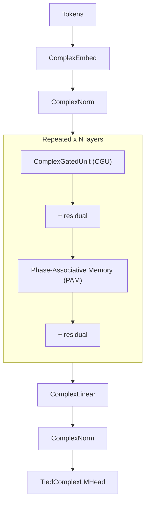

# QLLM — A Phase-Associative Memory Language Model

QLLM is an **attention-free, complex-valued** language model. Tokens live in complex
**phase space**, and sequence memory is **Phase-Associative Memory (PAM)** — a complex
**matrix-state** associative layer that retrieves by **complex-conjugate phase matching**,
not by softmax attention and not by a standard real-valued SSM.

It is **not a transformer** and **not Mamba**. Inference is **O(1) per token** with a
fixed-size state — there is **no KV cache** that grows with context length.

> We use AI assistants (e.g. Cursor) to help build this. Every claim below is backed by code,
> reproducible probes, and dated training logs in this repo — not vibes.

**Paper:** [Phase-Associative Memory: Sequence Modeling in Complex Hilbert Space](https://arxiv.org/abs/2604.05030) (arXiv:2604.05030) — Vishwakarma & Agostino.

**Model weights (Hugging Face):** [gowravvishwakarma/qllm-pam-v11-e3k3-chat](https://huggingface.co/gowravvishwakarma/qllm-pam-v11-e3k3-chat)

> **Architecture still under development.** The PAM stack (gates, tokenizer, data recipe) is
> actively changing. We **restarted training from scratch** on the v2 line (phase-aware gate,
> vocab 50261). After every **+2B pretrain tokens** we ship a new checkpoint to Hugging Face
> under a **round revision tag** (e.g. `round-2b-gate`, `round-4b-gate`). Older weights on
> `main` are milestones for comparison, not the current training line — pin a revision tag for
> reproducibility.

---

## What problem it solves

Two dominant families each pay a tax:

- **Transformers** are O(T²) to train and keep a **KV cache that grows without bound** at
inference — long generation gets progressively more expensive in time and memory.
- **Vector SSMs** (e.g. Mamba) get O(1)-per-token inference, but a single **vector** state
`s ∈ ℝ^{S×d}` has **limited associative capacity**: cramming many facts into one vector
causes catastrophic interference. (An earlier QLLM experiment, Holographic State Binding,
failed for exactly this reason — and motivated PAM.)

**QLLM's bet:** give each head a **matrix** state and code keys by **phase**. You keep
O(1)-per-token inference *and* get high associative capacity (**O(d²)** associations per head
via outer-product storage). The architecture can *hold* the associations; training only has to
learn *when to write and when to protect*.

---

## Architecture and how it works

### Phase-first complex tokens

Each token is a **complex** vector: **magnitude** encodes *how salient*, **phase** encodes
*what kind of meaning*. A context shift ("bank" → finance vs. river) is a **phase rotation** —
rotations compose and are invertible. A single complex multiply
`(a+bi)(c+di) = (ac−bd) + (ad+bc)i` carries four cross-terms (rotation + scaling), so the
algebra is richer per parameter than two independent real vectors.

**Phase must be preserved end-to-end.** Passing complex activations through real nonlinearities
(GELU, plain sigmoid gates) destroys phase and collapses the design. QLLM uses phase-preserving
primitives throughout the main path: `modReLU`, `ComplexGatedUnit` (CGU), and `ComplexNorm`.

### The headline V11 block (`v11_e3_k3`)




**ComplexGatedUnit (CGU)** gives **dual control** that only exists in complex space — a standard
GLU gate scales *intensity* only; the CGU gate sets both **magnitude** (`how much`) and
**phase** (`what rotation`):

```python
# Standard GLU: gate controls intensity only
output = sigmoid(W_g @ x) * (W_v @ x)

# CGU: magnitude AND phase
output = modReLU(|W_g @ z|) * rotate(z, arg(W_g @ z)) * (W_v @ z)
```

---

## PAM math — why it works

The PAM layer keeps a complex matrix state `S ∈ ℂ^{H×d×d}` per head and updates it with an
**outer product** of value and conjugated key:

```text
State:     S_t = γ_t · S_{t-1} + V_t ⊗ K_t*     # outer product; K* is the complex conjugate
Retrieve:  Y_t = S_t @ Q_t                       # complex-conjugate match, no softmax
Train:     chunked dual form        O(T·C)       # GPU-friendly dense matmuls
Infer:     recurrent                O(1)/token   # fixed state, no KV cache
```

**Why conjugate matching works.** `K* · Q` is a complex inner product: when the query phase
**aligns** with a stored key phase the contribution adds **constructively**; when it is
misaligned it cancels **destructively**. Retrieval is **interference**, not a length-normalized
softmax over positions. There is no softmax in the core path.

**Why the capacity is real.** Each `V ⊗ K`* writes a full **d×d** (rank-1) association. A matrix
state therefore stores **O(d²)** associations per head, where a single vector state stores ~O(d)
and interferes badly past a handful. This is an *architectural* property — it holds before any
training (see the binding-capacity probe below).

**E3 multistate (the V11 win).** Instead of one matrix state, each head keeps **K** matrix
states with distinct decay biases; at retrieval they are combined by **data-dependent phase
interference** (a learned `phase_proj`). It is essentially **param-matched** (only `phase_proj`
plus K decay biases are added) and inference stays **O(K·d²)/token** — still constant in
sequence length. K=3 is the current best.


| Aspect    | Transformer                    | Vector SSM (Mamba)   | QLLM PAM                        |
| --------- | ------------------------------ | -------------------- | ------------------------------- |
| State     | KV cache (grows with T)        | vector `s ∈ ℝ^{S×d}` | matrix `S ∈ ℂ^{H×d×d}`          |
| Matching  | `QKᵀ` + softmax                | gated recurrence     | complex conjugate `K*·Q`        |
| Capacity  | O(n) per seq                   | ~O(S·d)              | **O(H·d²)** per layer           |
| Inference | O(T) per token + growing cache | O(1) per token       | **O(1) per token**, fixed state |


---

## Objective proof (from probes and logs, not claims)

### 1. Mechanism probes — the math, before any training

`memory_probes/` is a standalone, **reproducible** (`seed=42`) battery that tests the PAM math
with no trained LM. Run it yourself: `./scripts/run_memory_probes.sh`. Full tables and JSON in
[memory_probes/README.md](memory_probes/README.md) and `logs/memory_probes/`.


| Probe                                     | Result                                                                                                                        |
| ----------------------------------------- | ----------------------------------------------------------------------------------------------------------------------------- |
| **Binding capacity**                      | **100%** retrieval @ 64 associations (d=64) vs **~13%** for vector HRR                                                        |
| **Correctness** (selftest / layer-bridge) | Chunked/dual train form ≡ O(1) recurrent form, `max|Δ| ≤ 1e-7` — the implementation is provably correct                       |
| **Long context**                          | With GSP protection a needle survives to **65K+** tokens; bare decay loses it (mechanism ceiling)                             |
| **Language filler**                       | Real WikiText interference: language relative retrieval ≈ **9.3** mean, **beats random on all 50 projection seeds** (min 14×) |


In one line: matrix outer-product storage gives **near-perfect multi-association retrieval where
vector memory fails**, with O(d²) capacity per head and O(1) recurrent inference at any length.

### 2. WikiText-103 (same data pipeline, ~100M params, single RTX 4090, 10 epochs)

Validation perplexity progression as the architecture improved:

- V6 `medium-pam-v3` (interleaved CGU+PAM) — **29.95**
- V7 `7d` (flat stack, chunked dual form, B=18) — **26.88**
- V11 E3 **K=2** (multistate) — **26.01**
- V11 E3 **K=3** (current best) — **25.77**  (~100.5M params)

**Honest baseline (inline, not hidden):** a same-pipeline GPT-2-style transformer (B=18) reaches
val PPL **22.69** — so PAM is **+3.08 PPL behind** on this benchmark. We report this on purpose.
The trade is deliberate: PAM gives a **different memory mechanism** and **O(1)-per-token
inference with no KV cache**, and the PAM path has **no Flash-class custom CUDA/Triton kernels**
yet, while the baseline rides PyTorch SDPA/Flash. The gap has shrunk every generation
(+7.26 → +4.19 → +3.08).

> GPU-poor mercy clause: this line of work is essentially one person, months to years, on a single RTX 4090 and some access to one RTX PRO 6000. We're compute-budget-limited, not malice-limited — be kind.

### 3. The milestone: a non-transformer, non-Mamba model that *chats*

The Phase C pipeline — **DCLM-Edu pretrain → chat SFT** on the fixed ~100M `v11_e3_k3`
architecture — produces coherent, instruction-following chat. The pretrain demonstrably worked:


| Checkpoint             | WikiText val PPL | DCLM-Edu holdout PPL |
| ---------------------- | ---------------- | -------------------- |
| WikiText-only base     | 25.77            | 1222.11              |
| + 2B DCLM-Edu pretrain | 66.26            | **33.86**            |


The DCLM holdout collapse (1222 → 33.86) confirms the base learned the new domain; the WikiText
rise is expected domain shift (WikiText is only an anchor). To our knowledge this is a working
conversational model built on **phase-associative memory** — not a transformer, not an SSM, with
O(1)-per-token recurrent inference.

---

## Chat examples (~100M model)

Real, logged greedy-ish samples from `logs/v11/sft_ab_run_20260619.log` (DCLM-Edu base +
chat SFT):

> **User:** What is the capital of France?
> **Assistant:** The capital of France is Paris, and it's located in the heart of France. It's
> home to over 1 million people … famous for its historical landmarks like the Eiffel Tower,
> Louvre Museum … France has a rich history dating back to the 15th century …

> **User:** Explain photosynthesis in one sentence.
> **Assistant:** Photosynthesis is a vital process that involves … plants, algae, and some
> bacteria … where sunlight, carbon dioxide, and water from the atmosphere are absorbed …
> the direct use of glucose to convert light energy into chemical energy …

> **User:** Write a Python function that adds two numbers.
> **Assistant:**
>
> ```python
> def add_numbers(a, b):
>     return a + b
> ```

**Honest caveats (read before celebrating):** at ~100M params with only **2B** pretrain tokens,
**facts are unreliable** (wrong dates/founders), responses can **ramble**, and there is a known
**end-of-turn bug** (the model was never trained to stop). These are a *pretraining-scale*
ceiling, not an architecture failure — knowledge comes from pretraining, so the next phase scales
pretraining (DCLM-Edu + FineWeb-Edu, ~10B+ tokens), fixes ChatML/EOS, then re-SFTs on chat data.

---

## Continuous shipping (v2 gate line)

The architecture and training recipe are **still evolving**; we treat each shipped round as a
**snapshot**, not a frozen product. We **retrain from scratch** on the v2 line, then add **+2B
fresh pretrain tokens** per round (no token reuse), run chat SFT, and publish the weights to
**[gowravvishwakarma/qllm-pam-v11-e3k3-chat](https://huggingface.co/gowravvishwakarma/qllm-pam-v11-e3k3-chat)**
under a **revision tag** (`round-2b-gate`, `round-4b-gate`, …). Full provenance per round:
**[v11/MODEL_RELEASES.md](https://github.com/gowrav-vishwakarma/qllm2/blob/master/v11/MODEL_RELEASES.md)**.

**What every round trains on (knowledge + reasoning + chat):**

| Ingredient | Dataset | Role |
|-----------|---------|------|
| Knowledge / grammar | DCLM-Edu + FineWeb-Edu (edu≥3) | web pretrain, unique per round (`skip_docs`) |
| Reasoning + chat | smoltalk2 **Mid** (~35B tok), ChatML-rendered | blended into pretrain after a grammar warmup |
| Chat behavior | smoltalk2 **SFT** (think-capped) | per-round supervised fine-tune |

Preset `v11_e3_k3_chat`: phase-aware GSP gate, vocab **50261** (ChatML `<|im_start|>`/`<|im_end|>`
+ reasoning `<think>`/`</think>`). Freshness is guaranteed by per-source cursors saved in each
checkpoint; the blend adds a small ChatML+reasoning sprinkle so those tokens are trained from
step 0.

**Run a round** (GCP training, then publish from the RTX4090):

```bash
# Round 1 from scratch (2B blended pretrain -> SFT -> smoke -> export)
ROUND=1 ROUND_TAG=round-2b-gate SCRATCH=1 TOKEN_BUDGET=2000000000 \
  tmux new-session -d -s v11_round './scripts/run_v11_round.sh pretrain'
./scripts/run_v11_round.sh probes && ./scripts/run_v11_round.sh sft
./scripts/run_v11_round.sh smoke
ROUND=1 ROUND_TAG=round-2b-gate TOKEN_BUDGET=2000000000 ./scripts/run_v11_round.sh export
# On RTX4090 (has HF token): incremental pull -> verify -> push revision tag
ROUND_TAG=round-2b-gate ./scripts/run_v11_round.sh ship
```

**Pull a specific shipped round** from the HF repo:

```bash
huggingface-cli download gowravvishwakarma/qllm-pam-v11-e3k3-chat --revision round-2b-gate --local-dir .
# Browse all tags: https://huggingface.co/gowravvishwakarma/qllm-pam-v11-e3k3-chat
```

**What to ask / current limits** (per-round card in
[hf_release/README.md](hf_release/README.md)): good at short factual Q&A, simple instructions,
and ChatML multi-turn; still weak at math, long reasoning, and rare facts (100M base). Tulu-3 is
**not** used routinely — only as an optional instruct-upgrade branch after saturation gates pass.

---

## How we got to V11 (brief history)

- **V4** — Complex phase-space tokens and wave-style interference. Real nonlinearities **broke
phase**; promising but inconsistent.
- **V5** — **Phase-preserving** stack (`modReLU`, CGU, `ComplexNorm`). A 28.7M model beat much
larger V4 runs.
- **V6** — Modular toolkit (banks, SSM, PAM, memory tiers). `medium-pam-v3`: **29.95**.
- **V7** — Lean flat 16×384 CGU+PAM stack; **7d** chunked dual form: **26.88**.
- **V8 / V9 / V10** — Mostly **negative**: reasoning loops (V8), PAM readout/conv gates (V9),
and a custom Triton Flash-PAM that was correct but **slower** than compiled PyTorch (V10).
- **V11** — **E3 multistate superposition**: K phase-routed matrix states per head. **K=2 →
26.01**, **K=3 → 25.77** — the first in-family memory win over 7d — plus the Phase C chat
milestone above.

**Dead ends (do not revisit without new evidence):** V9 readout gates, V10 custom Triton,
V11 E1 per-channel decay (a tie that doesn't stack with E3), V11 E2 delta-rule write (impractical
compile cost), and V7 hierarchy / multi-scale loss / reverse-assoc / learned positions.
Details: [v11/EXPERIMENTS_V11.md](v11/EXPERIMENTS_V11.md),
[EXPERIMENTS_V_6_7_8_9.md](EXPERIMENTS_V_6_7_8_9.md).

---

## Quick Start

```bash
# Install
uv sync
uv sync --extra cuda          # CUDA extras

# Train the headline V11 config on WikiText-103 (~100.5M params, val PPL 25.77)
./scripts/run_v11_exp.sh v11_e3_k3

# Knowledge pretrain from scratch: ~100M `v11_e3_k3_chat` (chat vocab baked in),
# DCLM-Edu + FineWeb-Edu mix, ~10B-token budget, cosine LR, resumable.
# >>> Text pretrain ~10B on RTX PRO 6000 (server, tmux v11_pretrain) — 2026-06-24 <<<
tmux new-session -d -s v11_pretrain './scripts/run_v11_pretrain_scratch.sh'
# custom budget (e.g. 20B): ./scripts/run_v11_pretrain_scratch.sh 20000000000
# resume after a stop: RESUME=checkpoints_v11_e3_k3_chat_pretrain/latest.pt \
#   ./scripts/run_v11_pretrain_scratch.sh

# Reproduce the PAM mechanism probes (no checkpoint needed)
./scripts/run_memory_probes.sh

# Duplex audio POC (4090, parallel — turn-taking, NOT speech-to-speech):
./scripts/run_v11_duplex_stage1.sh          # train Stage 1 (Kathbath hi/gu default)
./scripts/run_v11_duplex_gradio.sh          # mic → listen / speak / backchannel

# Chat with a trained / SFT checkpoint
python scripts/chat_v11.py --checkpoint checkpoints_v11_e3_k3_chat_pretrain/best_model.pt
```

### Parallel tracks (2026-06-24)

| Track | GPU | What |
|-------|-----|------|
| **Text pretrain ~10B** | RTX PRO 6000 | `v11_e3_k3_chat`, DCLM-Edu + FineWeb-Edu, resumable `latest.pt` every 5000 steps |
| **Duplex audio POC** | RTX 4090 | ~5M V11 PAM E3 K=3 + **frozen Whisper encoder**; predicts `<listen>` / `<speak>` / `<backchannel>` — **not an S2S model** (no speech output yet) |

Duplex is **additive only** (`v11/duplex/`); it does not modify pretrain scripts or shared `v11/model.py`.
Stage 1 Hindi+Gujarati: **100% val thinking accuracy**, 232 s —
`checkpoints_v11_duplex_5m_stage1_hi_gu/best_model.pt`.
Math, scope, and results: [v11/duplex/EXPERIMENTS_DUPLEX.md](v11/duplex/EXPERIMENTS_DUPLEX.md).

Other presets, Phase C pretrain/SFT runners, and older version paths live in the docs below.

---

## Documentation

- **Model weights (Hugging Face):** [gowravvishwakarma/qllm-pam-v11-e3k3-chat](https://huggingface.co/gowravvishwakarma/qllm-pam-v11-e3k3-chat) — new checkpoint every **+2B tokens** under a **round revision tag** (`round-2b-gate`, …); architecture still evolving.
- **Paper:** [Phase-Associative Memory: Sequence Modeling in Complex Hilbert Space](https://arxiv.org/abs/2604.05030) (arXiv:2604.05030)
- [memory_probes/README.md](memory_probes/README.md) — PAM mechanism validation: binding,
long-context NIAH, interference, rank; why matrix memory beats vector state.
- [v11/EXPERIMENTS_V11.md](v11/EXPERIMENTS_V11.md) — current: E1/E2/E3 ablations, K-sweep,
Phase C pretrain + chat SFT; **parallel duplex track** pointer.
- [v11/duplex/EXPERIMENTS_DUPLEX.md](v11/duplex/EXPERIMENTS_DUPLEX.md) — full-duplex POC
(SALMONN-style): PAM + Whisper math, Stage 0/1 results, Gradio demo; runs parallel to 10B pretrain.
- [v11/BEGINNER_GUIDE.md](v11/BEGINNER_GUIDE.md) — gentle walkthrough of phase, complex numbers,
and fixed-size PAM memory in code.
- [EXPERIMENTS_V_6_7_8_9.md](EXPERIMENTS_V_6_7_8_9.md) — cross-version PPL rollup and dead ends.
- [v7/EXPERIMENTS_V7.md](v7/EXPERIMENTS_V7.md) · [v6/README.md](v6/README.md) ·
[v5/README.md](v5/README.md) — earlier generations.
- Research notes: `QLLM_CORE_IDEA.pdf`, `v5/paper/`, `QLLM_V2.pdf`.
- The previous, longer README is preserved as [README_OLD.md](README_OLD.md).

---

## Contributing & License

Contributions are subject to the project's [Contributor License Agreement](CLA.md); see
[CONTRIBUTING.md](CONTRIBUTING.md). Licensed under the **MIT License** — see [LICENSE](LICENSE).