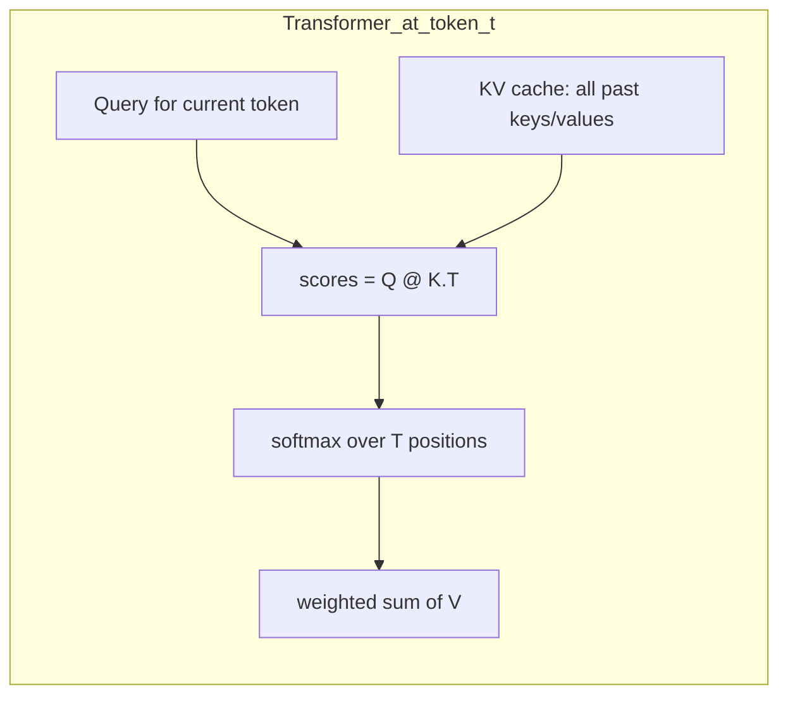
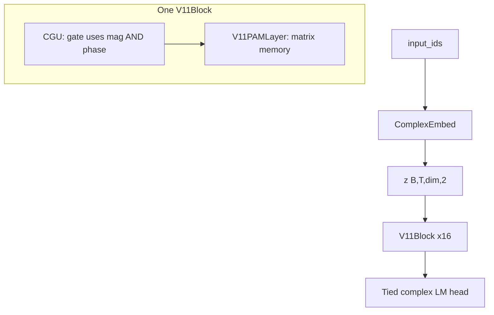

# V11 Beginner Guide: Phase, Complex Numbers, and O(1) Memory

A plain-language tour of how **V11** (our current base architecture) processes text using **complex numbers**, **magnitude and phase**, and a **fixed-size matrix memory** instead of transformer attention.

**Who this is for:** you know basic Python (lists, loops, functions) but may be new to PyTorch or neural nets.

**Production preset:** `v11_e3_k3` — 16 layers, 6 heads, head dim 64, **3 superposed memory states** (E3). See `[get_config("v11_e3_k3")](model.py)`.

**Related docs:** experiment results in [EXPERIMENTS_V11.md](EXPERIMENTS_V11.md) · deeper math in [../notebooks/qllm_v7_math_tutorial.ipynb](../notebooks/qllm_v7_math_tutorial.ipynb) · repo overview in [../README.md](../README.md).

---

## 1. The story: "The cat sat on the mat" (transformer attention first)

Before we look at V11, let's see how a **transformer** handles the same sentence — because that's the classic "2D matrix" picture people learn first.

### Tokenize the sentence

GPT-2 splits text into subword tokens:

```
The | cat | sat | on | the | mat
 T=6 positions (we'll use T for "sequence length")
```

In code (requires `transformers`):

```python
from transformers import AutoTokenizer

tokenizer = AutoTokenizer.from_pretrained("gpt2")
text = "The cat sat on the mat"
tokens = tokenizer.tokenize(text)
ids = tokenizer.encode(text)
print(tokens)   # ['The', ' cat', ' sat', ' on', ' the', ' mat']
print(len(ids)) # 6
```

Each token becomes a **real vector** of length `d_model` (e.g. 768 in our transformer baseline).

### The attention score matrix (T × T)

At each position, the model asks: *"How much should I look at every earlier token?"*

For position `t`, it computes a **query** vector `Q_t` and compares it to **key** vectors `K_0 … K_t` from all allowed past positions. Those comparisons fill one **row** of an attention matrix:

```
scores[t, j] = dot(Q_t, K_j)   for j = 0 … t
```

Then **softmax** turns each row into weights that sum to 1, and the output is a weighted mix of **value** vectors `V`.

**Toy example (made-up numbers, d=3):**

Imagine only 3 tokens: `The | cat | sat`. After computing dot products and softmax:


|         | The  | cat  | sat  |
| ------- | ---- | ---- | ---- |
| **The** | 1.00 | —    | —    |
| **cat** | 0.40 | 0.60 | —    |
| **sat** | 0.15 | 0.25 | 0.60 |


(`—` = masked out; a token cannot attend to the future.)

Each row is a **distribution over past tokens**. The matrix is **causal**: lower triangle only. As the sentence grows, the matrix grows — at token 6 ("mat") you have a full **6×6** block of scores.

### Why this matters for cost

At **inference**, a transformer does **not** re-read the whole sentence from scratch each time. Instead it keeps a **KV cache**: all past keys and values stored in a list that grows with every new token.

When generating the next word after "mat", the model still computes attention over **all 6 prior positions** (and more as generation continues).

```
Per new token at step t:  work ∝ t  (grows with sentence length)
State stored:              all past K and V vectors  →  O(t) memory
```

Our transformer baseline lives in `[v6/transformer_baseline.py](../v6/transformer_baseline.py)`. The core call is:

```python
y = F.scaled_dot_product_attention(q, k, v, is_causal=True)
```

That builds the score matrix and weighted sum — friendly on GPU, but **cost scales with how many tokens came before**.




**Takeaway:** transformer memory is *explicit over positions* — a growing T×T (or T-length cache) story.

---

## 2. Same sentence, different memory: PAM's fixed matrix

V11 does **not** keep a score row per past token. Instead, each PAM head keeps one **fixed-size matrix** `S` of shape **d × d** (d = 64 in `v11_e3_k3`).

Think of it as a **spreadsheet with 64 rows and 64 columns** — same size whether the sentence has 6 words or 6,000.

### Three steps per token

For each new word, PAM repeats:

1. **Forget a little** — multiply the whole matrix by a decay factor γ (between 0 and 1)
2. **Write one association** — add an outer product `V ⊗ K`* (value times conjugate of key)
3. **Read with a query** — multiply the matrix by the current query: `Y = S @ Q`

In symbols (one head, one state):

```
S_t = γ_t · S_{t-1} + V_t ⊗ K_t*
Y_t = S_t · Q_t
```

The `*` on `K` means **complex conjugate** (flip the sign of the imaginary part). We'll explain why in §3.

### Tiny numeric walkthrough (d = 3, real numbers only)

To build intuition, pretend everything is a plain real number (no complex part yet).

```python
# Start with an empty notebook
S = [[0.0, 0.0, 0.0],
     [0.0, 0.0, 0.0],
     [0.0, 0.0, 0.0]]

gamma = 0.9          # forget 10% each step
v = [1.0, 0.0, 0.0]  # value vector for "cat"
k = [0.0, 1.0, 0.0]  # key vector for "cat"
q = [0.0, 1.0, 0.0]  # query at "cat"

# Step 1: decay
S = [[gamma * S[i][j] for j in range(3)] for i in range(3)]

# Step 2: outer product write  outer[i,j] = v[i] * k[j]
outer = [[v[i] * k[j] for j in range(3)] for i in range(3)]
S = [[S[i][j] + outer[i][j] for j in range(3)] for i in range(3)]

# Step 3: read  y[i] = sum_j S[i,j] * q[j]
y = [sum(S[i][j] * q[j] for j in range(3)) for i in range(3)]
print("S after one token:", S)
print("read y:", y)
```

No loop over past tokens `"The"`, `"cat"`, … — just **update one matrix, then read once**.

### Where this lives in code

The real implementation is `_recur_step_additive` in `[v11/model.py](model.py)`:

```python
def _recur_step_additive(self, S, g, v_t, k_t, q_t):
    # 1. Build outer product V ⊗ K*  (complex — see §3)
    k_conj = torch.stack([k_t[..., 0], -k_t[..., 1]], dim=-1).unsqueeze(-3)
    outer_r = v_t[..., 0].unsqueeze(-1) * k_conj[..., 0] - ...
    outer_i = v_t[..., 0].unsqueeze(-1) * k_conj[..., 1] + ...
    outer = torch.stack([outer_r, outer_i], dim=-1)   # [B,H,d,d,2]

    # 2. Decay then add write
    S = S * gg + outer

    # 3. Read Y = S @ Q  (complex matvec)
    sq_r = S[..., 0] * q_t[..., 0].unsqueeze(-2) - S[..., 1] * q_t[..., 1].unsqueeze(-2)
    sq_i = S[..., 0] * q_t[..., 1].unsqueeze(-2) + S[..., 1] * q_t[..., 0].unsqueeze(-2)
    y = torch.stack([sq_r.sum(dim=-1), sq_i.sum(dim=-1)], dim=-1)
    return y, S
```

**Shapes in the full model:**


| Tensor              | Shape                | Meaning                       |
| ------------------- | -------------------- | ----------------------------- |
| `S` (one state)     | `[B, H, d, d, 2]`    | Matrix memory per batch, head |
| `S` (E3, K=3)       | `[K, B, H, d, d, 2]` | Three parallel notebooks      |
| `v_t`, `k_t`, `q_t` | `[B, H, d, 2]`       | Complex vectors per head      |


**Cost per new token:** O(d²) per head — **constant in T**. For `v11_e3_k3`: H=6, d=64, K=3 → fixed work every step, no KV cache growth.

---

## 3. Why complex numbers? Magnitude and phase as two knobs

V11 stores numbers as **complex**: each value has a **real part** and an **imaginary part**. In code this is always a **split-real** tensor with shape `[..., 2]`:

```
[..., 0] = real
[..., 1] = imaginary
```

We **never** use `torch.complex64` in this codebase (autograd and memory issues). See the module docstring at the top of `[v11/model.py](model.py)`.

### Magnitude and phase

From real `(r, i)`:

```
magnitude  |z| = sqrt(r² + i²)     →  "how loud / how salient"
phase      arg(z) = angle in plane  →  "which direction" / kind of meaning
```

**Intuition:** magnitude is volume; phase is which way a dial points. Rotating phase (multiplying by `e^{iθ}`) changes *kind* without necessarily changing *strength*.

### Hand example: same magnitude, different phase

Take `z = 3 + 4i` (magnitude 5).


| Multiply by | Effect      | Product   |
| ----------- | ----------- | --------- |
| `1 + 0i`    | no rotation | `3 + 4i`  |
| `0 + 1i`    | rotate 90°  | `-4 + 3i` |


Same input magnitude, different multiplier phase → **different output**. 

++**That's why complex space is richer than two independent real vectors.**++

### Core functions in `[v7/model.py](../v7/model.py)`

```python
def cmul(a, b):
    """(a_r + i·a_i)(b_r + i·b_i) — multiply = scale + rotate"""
    return torch.stack([
        a[..., 0] * b[..., 0] - a[..., 1] * b[..., 1],
        a[..., 0] * b[..., 1] + a[..., 1] * b[..., 0],
    ], dim=-1)

def cconj(x):
    """Conjugate: flip sign of imaginary part"""
    return torch.stack([x[..., 0], -x[..., 1]], dim=-1)

def cabs(x):
    """Magnitude"""
    return torch.sqrt(x[..., 0].square() + x[..., 1].square() + 1e-8)
```

**Runnable snippet** (from repo root):

```python
import torch
from v7.model import cmul, cabs, cconj

# One complex number as [real, imag]
z = torch.tensor([3.0, 4.0])
print("magnitude:", cabs(z).item())          # 5.0

no_rot = torch.tensor([1.0, 0.0])
rot90  = torch.tensor([0.0, 1.0])
print("× 1:", cmul(z, no_rot))               # [3, 4]
print("× i:", cmul(z, rot90))                # [-4, 3]

# Conjugate of key used in memory write
k = torch.tensor([0.5, 0.2])
print("K*:", cconj(k))                       # [0.5, -0.2]
```

### Token embeddings are complex

Each token ID maps to **two** embedding vectors — real and imaginary — stacked into shape `[B, T, dim, 2]`:

```python
class ComplexEmbed(nn.Module):
    def forward(self, ids):
        return torch.stack([self.embed_real(ids), self.embed_imag(ids)], dim=-1)
```

So `"cat"` is not one vector; it's a complex vector with separate learned real and imag parts.

### Phase-preserving activations

Real activations like GELU would **destroy phase** (they mix real and imag arbitrarily). V11 uses **ModSwish**: apply Swish to **magnitude only**, leave phase unchanged:

```python
class ModSwish(nn.Module):
    """Swish on magnitude, phase untouched."""
```

Early experiments showed that breaking phase collapses the design — see "Phase must be preserved" in [../README.md](../README.md).

---

## 4. Where magnitude and phase work *together* in V11

Full stack:

```
input_ids
  → ComplexEmbed (+ optional position)
  → ComplexNorm
  → [ V11Block ] × 16
       each block:  x += CGU(Norm(x))     # channel mixing
                    x += PAM(Norm(x))     # sequence memory
  → output_norm → lm_head → logits
```




### Stage-by-stage: who uses magnitude vs phase


| Stage                  | Magnitude role                                      | Phase role                                         | Code location                                                |
| ---------------------- | --------------------------------------------------- | -------------------------------------------------- | ------------------------------------------------------------ |
| **RoPE on Q/K**        | unchanged                                           | rotate Q,K by position `e^{iθ}` via `cmul(q, pos)` | `build_rope_cache`, `_project` in `[v11/model.py](model.py)` |
| **GSP (protect gate)** | reads `cabs(x)` to decide what **not** to overwrite | —                                                  | `_gamma_and_vprime` ~198–205                                 |
| **Decay γ**            | computed from `cabs(x)` through `dt_proj`           | —                                                  | `_gamma_and_vprime`                                          |
| **Write**              | outer product strength                              | `K`* stores conjugate → phase relation in `S`      | `_recur_step_additive`                                       |
| **Read**               | matvec magnitude                                    | phase **coherence** via complex multiply           | `sq_r`, `sq_i` in read step                                  |
| **E3 (V11 signature)** | `phase_proj(cabs(x))` → angle φ                     | rotate each state's output by `e^{iφ}`, sum        | `_forward_multistate`, `_recurrent`                          |
| **LM head**            | logit strength                                      | cross-terms: `z_r @ E_r^T + z_i @ E_i^T`           | `V11LM.forward` ~670–672                                     |


### RoPE: phase encodes position

Rotary position embedding multiplies Q and K by a position-dependent rotation:

```python
# angles[m, k] = position m × frequency k
pos = rope_cache[step_offset : step_offset + T]   # [T, d, 2] as cos,sin pairs
q = cmul(q, pos)
k = cmul(k, pos)
```

So "where in the sentence" is a **phase rotation**, not a separate big position embedding table (V11 default: `use_learned_pos=False`, `use_rope=True`).

### GSP: magnitude decides what to protect

```python
p = torch.sigmoid(self.protect_gate(cabs(x)))   # protect probability
gamma = exp(-dt) * (1 - p) + p                  # high p → barely decay
v_prime = v * (1 - p)                           # high p → don't write
```

Important memories (large magnitude patterns) can **freeze** parts of the state instead of being overwritten.

### E3: three notebooks + phase interference (why V11 beats V7)

Preset `v11_e3_k3` sets `n_states=3`. Each state is its own d×d matrix with a slightly different decay speed. At read time:

```python
phi = phase_proj(cabs(x))          # pick phase angles from magnitude pattern
y_k = read_from_state_k(S_k, Q)
rot = [cos(phi), sin(phi)]         # e^{iφ}
y_k = cmul(y_k, rot)               # rotate in complex plane
Y = y_0 + y_1 + y_2                # interference: add rotated outputs
```

**Beginner analogy:** three radio stations (three memories) broadcasting answers; the model tunes phase knobs so signals **add up or cancel** — like constructive/destructive interference.

This is the main V11 upgrade over V7. E1 (per-channel decay) and E2 (delta write) exist as experiments but are **not** in the best preset; see [EXPERIMENTS_V11.md](EXPERIMENTS_V11.md).

---

## 5. Side-by-side: attention matrix vs PAM matrix

This is the "2D matrix" picture for both architectures.

### Transformer: growing T × T matrix

Each row = "who does this token attend to?"

```
              The    cat    sat    on    the    mat
The         [  *     .      .      .      .      .  ]
cat         [  *     *      .      .      .      .  ]
sat         [  *     *      *      .      .      .  ]
on          [  *     *      *      *      .      .  ]
the         [  *     *      *      *      *      .  ]
mat         [  *     *      *      *      *      *  ]
              ↑ full triangle at last token — size grows with T
```

At inference step t, you need keys/values for **all t positions** (KV cache).

### PAM: fixed d × d matrix (same size every step)

History is **compressed** into one matrix via repeated rank-1 updates — no row per token.

```
S matrix (64×64 in v11_e3_k3) — ALWAYS the same shape:

Start:     S₀ = zeros

"The":     S₁ = γ·S₀ + V_The ⊗ K_The*
"cat":     S₂ = γ·S₁ + V_cat ⊗ K_cat*
"sat":     S₃ = γ·S₂ + V_sat ⊗ K_sat*
...
"mat":     S₆ = γ·S₅ + V_mat ⊗ K_mat*

Read:      Y = S₆ @ Q_mat     ← one matrix-vector multiply, no loop over 6 words
```

**Key difference:** the transformer **stores each past token explicitly** in the cache. PAM **folds** past tokens into `S`; older information fades via γ unless reinforced.

Trade-off (honest): compression can cause interference when many facts compete in the same d×d space — E3 multi-state helps by giving three timescales/notebooks.

---

## 6. O(1) inference in code (training vs inference)

V11 uses **two equivalent math paths**:


| Mode                   | When                             | Cost vs T          | Purpose                   |
| ---------------------- | -------------------------------- | ------------------ | ------------------------- |
| **Parallel / chunked** | Training: `state=None`, T>1      | O(T) or O(T·C)     | GPU-friendly matmuls      |
| **Recurrent**          | Inference: carry `state`, or T=1 | **O(1) per token** | Fixed memory, no KV cache |


Same math, different implementation — verified by `[v11/selftest.py](selftest.py)`.

### Dispatch in `V11PAMLayer.forward`

```python
def forward(self, x, state=None, step_offset=0):
    q, k, v = self._project(x, step_offset)

    if state is None and T > 1:
        # TRAINING: parallel dual / chunked / multistate forms
        ...
    else:
        # INFERENCE: one step at a time, update S in place
        y, new_state = self._recurrent(x, q, k, v, state, d)
```

### Generation carries state forward

From `V11LM.generate` in `[v11/model.py](model.py)`:

```python
logits, states, _ = self.forward(generated)       # process prompt once
step = generated.shape[1]
for _ in range(max_new_tokens):
    ...
    logits, states, _ = self.forward(nxt, states=states, step_offset=step)
    step += 1
```

Each new token: **one** forward on a **single** ID, reusing PAM states from all 16 layers. `step_offset` keeps RoPE positions correct without reprocessing history.

### Complexity comparison


|                             | Transformer           | V11 PAM (`v11_e3_k3`)            |
| --------------------------- | --------------------- | -------------------------------- |
| Extra state at step t       | O(t · H · d) KV cache | O(K · H · d²) fixed matrix cells |
| Work per new token          | O(t · d) attention    | O(K · H · d²) mat ops            |
| Grows with sentence length? | **Yes**               | **No**                           |


For our preset: K=3, H=6, d=64 → memory state size is constant whether t=6 or t=6000.

**Note on "O(1)":** we mean **O(1) in sequence length T** — work per token is bounded by fixed hyperparameters (K, H, d), not by how many tokens came before. Work still depends on d².

### Prove it yourself: parallel == recurrent

Runnable from repo root (mirrors `selftest.py`):

```python
import torch
from v11.model import V11Config, V11PAMLayer

cfg = V11Config(
    vocab_size=512, dim=32, n_heads=2, head_dim=16, n_layers=1,
    expand=2, dropout=0.0, chunk_size=24, n_states=3,  # tiny E3
    gradient_checkpointing=False,
)
torch.manual_seed(0)
layer = V11PAMLayer(cfg).eval()
x = torch.randn(1, 40, cfg.dim, 2) * 0.5   # [B=1, T=40, dim, 2]

with torch.no_grad():
    y_par, _ = layer(x, state=None)          # parallel training path

    y_steps = []
    state = None
    for t in range(x.shape[1]):
        y_t, state = layer(x[:, t:t+1], state=state, step_offset=t)
        y_steps.append(y_t)
    y_rec = torch.cat(y_steps, dim=1)

diff = (y_par - y_rec).abs().max().item()
print(f"max|parallel - recurrent| = {diff:.2e}")
print("PASS" if diff < 1e-2 else "FAIL")
```

If `max|Δ|` is tiny, the fast recurrent path matches the training path — the O(1) implementation is correct.

### One PAM step with real V11 code (shapes annotated)

```python
import torch
from v11.model import V11Config, V11PAMLayer

cfg = V11Config(dim=32, n_heads=2, head_dim=8, n_states=1, dropout=0.0)
layer = V11PAMLayer(cfg).eval()

B, T, d, H = 1, 1, cfg.head_dim, cfg.n_heads
x = torch.randn(B, T, cfg.dim, 2) * 0.3        # one token, complex hidden state

with torch.no_grad():
    q, k, v = layer._project(x, step_offset=0)  # each [B,H,d,2]
    gamma, v_prime = layer._gamma_and_vprime(x, v)
    g = gamma[:, :, 0]                           # [B,H]
    S0 = torch.zeros(B, H, d, d, 2)
    y, S1 = layer._recur_step_additive(
        S0, g, v_prime[:, :, 0], k[:, :, 0], q[:, :, 0] * (d ** -0.5)
    )

print("S shape:", S1.shape)   # [1, 2, 8, 8, 2]  — fixed d×d, not [T,T]
print("y shape:", y.shape)    # [1, 2, 8, 2]
```

---

## 7. Try it yourself

### Correctness check (no GPU, no checkpoint)

```bash
.venv/bin/python -m v11.selftest
```

Expected: `ALL MODES PASS: parallel train form == O(1) recurrent form.`

### Load the production architecture

```python
from v11.model import V11LM, get_config

cfg = get_config("v11_e3_k3")
print(cfg.n_states)      # 3
print(cfg.n_heads)       # 6
print(cfg.head_dim)      # 64
model = V11LM(cfg)
print(model.count_parameters())
```

### Chat smoke test (needs a trained checkpoint)

```bash
.venv/bin/python scripts/smoke_chat_v11.py
```

Uses preset `v11_e3_k3_chat` (vocab 50259 with ChatML tokens).

### Suggested reading order

1. This guide (concepts + code map)
2. [EXPERIMENTS_V11.md](EXPERIMENTS_V11.md) (what we measured, E3 results)
3. [../notebooks/qllm_v7_math_tutorial.ipynb](../notebooks/qllm_v7_math_tutorial.ipynb) (tensor shape drills)
4. `[v11/model.py](model.py)` and `[v7/model.py](../v7/model.py)` (source)

---

## Glossary


| Term                    | Meaning                                                                       |
| ----------------------- | ----------------------------------------------------------------------------- |
| **Split-real**          | Complex number stored as `[real, imag]` last dim; shape `[..., 2]`            |
| **Conjugate K**         | Flip sign of imaginary part; used when writing keys into memory               |
| **Outer product V ⊗ K** | Rank-1 d×d update adding one association to matrix `S`                        |
| **Decay γ**             | Per-step forgetting factor in `(0,1]`; `S ← γ·S + write`                      |
| **RoPE**                | Rotary position embedding; encodes token index as phase rotation on Q,K       |
| **GSP**                 | Gated State Protection; magnitude-based gate to protect memory from overwrite |
| **PAM**                 | Phase-Associative Memory; d×d matrix state with conjugate retrieval           |
| **E3**                  | Multi-state PAM: K parallel matrices + phase-routed sum at read time          |
| **CGU**                 | ComplexGatedUnit; SwiGLU-style block that respects phase                      |
| **O(1) in T**           | Per-token cost does not grow with sequence length (fixed K,H,d)               |


---

## Quick reference: files to open


| File                                                          | What's inside                                          |
| ------------------------------------------------------------- | ------------------------------------------------------ |
| `[v11/model.py](model.py)`                                    | `V11PAMLayer`, `V11LM`, presets, `_recurrent`, E3      |
| `[v7/model.py](../v7/model.py)`                               | `cmul`, `cabs`, `ComplexEmbed`, `ModSwish`, RoPE cache |
| `[v11/selftest.py](selftest.py)`                              | Parallel vs recurrent equality tests                   |
| `[v6/transformer_baseline.py](../v6/transformer_baseline.py)` | Transformer attention baseline for comparison          |


