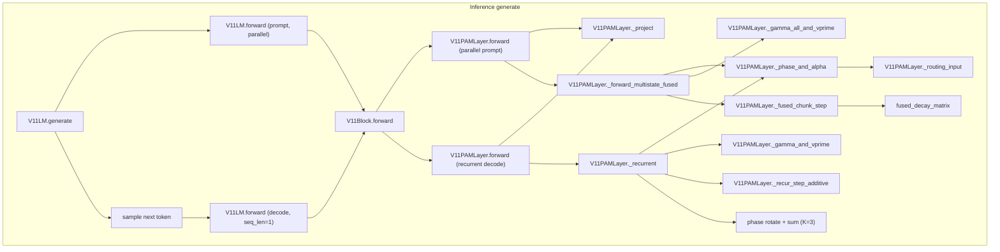

# E3 K3 Call Graph (production path only)

Production preset: `v11_e3_k3_chat` (E3 K=3, `gate_content_aware=True`, `fused_e3=True`, additive write, head decay). Latest release: round-6b-gate.

Regenerate: `uv run python -m v11.callgraph_e3k3 --write v11/CALLGRAPH_E3K3.md`

## Preset locks

| Flag | Value |
|------|-------|
| preset | `v11_e3_k3_chat` |
| `n_states` | 3 (K=3) |
| `gate_content_aware` | True |
| `fused_e3` | True |
| `decay_mode` | `head` |
| `write_mode` | `additive` |
| `routing_content_aware` | False |
| `state_compete` | False |

## Memory state shape (E3 K=3)

| Tensor | Shape | Notes |
|--------|-------|-------|
| PAM state `S` | `[K, B, H, d, d, 2]` | K=3 superposed d×d notebooks per head |
| After full seq (train) | same | returned from fused path |
| Carried in `generate` | same | updated each decode step |

## Train (fused CE + fused E3 parallel)

```mermaid
flowchart TD
  subgraph Train_fused_ce [Train fused_ce]
    train_main["v11.train.main"]
    block_fwd["V11Block.forward"]
    ce_from_lm["V11LM.ce_from_lm"]
    ckpt_block["V11LM._ckpt_block"]
    collect_route_aux["V11LM._collect_route_aux"]
    fused_ce["fused_linear_cross_entropy"]
    fused_decay["fused_decay_matrix"]
    hidden_to_lm["V11LM._hidden_to_lm"]
    pam_chunk["V11PAMLayer._fused_chunk_step"]
    pam_fused["V11PAMLayer._forward_multistate_fused"]
    pam_fwd["V11PAMLayer.forward"]
    pam_gamma_all["V11PAMLayer._gamma_all_and_vprime"]
    pam_phase["V11PAMLayer._phase_and_alpha"]
    pam_project["V11PAMLayer._project"]
    pam_routing["V11PAMLayer._routing_input"]
    trainer_epoch["V7Trainer.train_epoch"]
    trainer_train["V7Trainer.train"]
    train_main --> trainer_train
    trainer_train --> trainer_epoch
    trainer_epoch --> hidden_to_lm
    trainer_epoch --> ce_from_lm
    hidden_to_lm --> ckpt_block
    hidden_to_lm --> block_fwd
    hidden_to_lm --> collect_route_aux
    ckpt_block --> block_fwd
    ce_from_lm --> fused_ce
    block_fwd --> pam_fwd
    pam_fwd --> pam_project
    pam_fwd --> pam_fused
    pam_fused --> pam_chunk
    pam_fused --> pam_phase
    pam_fused --> pam_gamma_all
    pam_phase --> pam_routing
    pam_chunk --> fused_decay
  end
```

**Dispatch** ([`V11PAMLayer.forward`](model.py)): `state is None` and `seq_len > 1` and `n_states > 1` and `fused_e3` → `_forward_multistate_fused`.

## Inference (`V11LM.generate`)

**Two phases:**
1. **Prompt** — full sequence, `states=None` → same parallel fused E3 path as training.
2. **Decode** — one token at a time with `states` → `_recurrent` (K-loop over 3 states).

Excluded from both graphs: E1 per-channel, E2 delta, `_forward_multistate` K-loop fallback, competitive routing, flash-PAM, baseline single-state dual-form.
