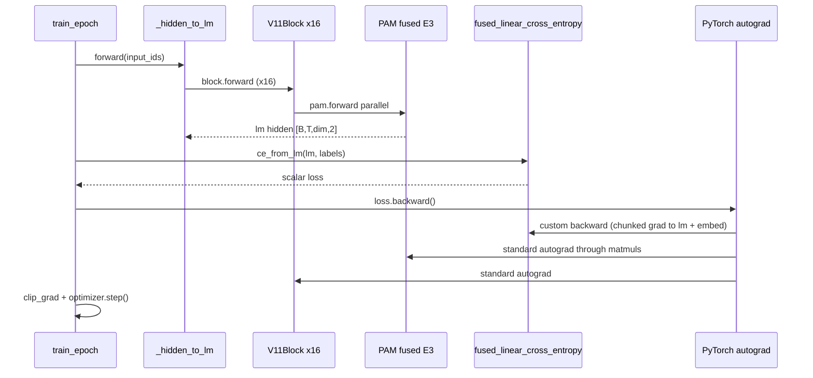
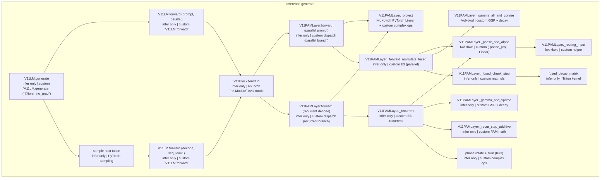

# E3 K3 Call Graph (production path only)

Production preset: `v11_e3_k3_chat` (E3 K=3, `gate_content_aware=True`, `fused_e3=True`, additive write, head decay). Latest release: round-6b-gate.

Regenerate: `uv run python -m v11.callgraph_e3k3 --write v11/CALLGRAPH_E3K3.md`

## Why two branches: `_hidden_to_lm` and `ce_from_lm`?

Production training (`--fused_ce`) does **not** call `V11LM.forward()`. Instead `V7Trainer.train_epoch` runs:

```
loss = ce_from_lm( _hidden_to_lm(input_ids), labels )
loss.backward()
```

| Branch | Returns | Built by | PyTorch? |
|--------|---------|----------|----------|
| `_hidden_to_lm` | Pre-logit hidden `lm` `[B,T,dim,2]` | Custom `V11LM` method | Uses PyTorch modules (`nn.Linear`, etc.) with normal autograd |
| `ce_from_lm` → `fused_linear_cross_entropy` | Scalar CE loss | Custom `v11/fused_ce.py` | **Custom** `autograd.Function`; uses `F.cross_entropy` only on small chunks |

**Why split?** The tied LM head is `logits = lm_r @ E_r.T + lm_i @ E_i.T` → one matmul to `[B*T, vocab]`. With vocab ≈ 50k and B×T ≈ 37k that tensor is ~4 GB, plus softmax and its grad. Materializing it dominates VRAM.

**Forward pass:** `_hidden_to_lm` runs the stack (optionally `torch.compile`'d). `fused_linear_cross_entropy` loops token-rows in chunks (default 4096), computes chunk logits, accumulates CE — peak memory O(chunk×vocab) not O(B×T×vocab).

**Backward pass:** `loss.backward()` first hits `_FusedLinearCE.backward` (custom — recomputes chunk logits/softmax, writes `grad_hidden`, `grad_weight`). Then autograd flows into `_hidden_to_lm` and the whole stack (blocks, PAM, embed). PAM uses PyTorch autograd through matmuls; `fused_decay_matrix` uses a Triton `autograd.Function`.

**Not PyTorch built-ins:** `_hidden_to_lm`, `ce_from_lm`, `fused_linear_cross_entropy`, E3 PAM paths, Triton kernels — all project code. PyTorch provides the autograd engine, `nn.Module`, `F.cross_entropy` (per chunk), `grad_checkpoint`, `torch.compile`, optimizer.

**Alternative (not used in production):** `V11LM.forward()` → full `logits [B,T,V]` → `F.cross_entropy`. Simpler but ~4 GB head memory.

## One training step (forward → backward)



## Preset locks

| Flag | Value |
|------|-------|
| preset | `v11_e3_k3_chat` |
| `n_states` | 3 (K=3) |
| `gate_content_aware` | True |
| `fused_e3` | True |
| `decay_mode` | `head` |
| `write_mode` | `additive` |
| `routing_content_aware` | False |
| `state_compete` | False |

## Memory state shape (E3 K=3)

| Tensor | Shape | Notes |
|--------|-------|-------|
| PAM state `S` | `[K, B, H, d, d, 2]` | K=3 superposed d×d notebooks per head |
| After full seq (train) | same | returned from fused path |
| Carried in `generate` | same | updated each decode step |

## Train call graph (fused CE + fused E3 parallel)

Node subtitles in the diagram: **phase | origin** (e.g. `fwd+bwd | custom`).

```mermaid
flowchart TD
  subgraph Train_fused_ce [Train fused_ce]
    train_main["v11.train.main<br/>setup | custom script"]
    block_fwd["V11Block.forward<br/>fwd+bwd | PyTorch `nn.Module` (custom `V11Block`)"]
    ce_from_lm["V11LM.ce_from_lm<br/>fwd+bwd | custom `V11LM` method"]
    ckpt_block["V11LM._ckpt_block<br/>fwd+bwd (recompute) | PyTorch `grad_checkpoint`"]
    collect_route_aux["V11LM._collect_route_aux<br/>fwd only (aux scalar) | custom"]
    fused_ce["fused_linear_cross_entropy<br/>fwd + custom bwd | custom `torch.autograd.Function` (`v11/fused_ce.py`)"]
    fused_decay["fused_decay_matrix<br/>fwd+bwd | Triton kernel (`v11/triton_kernels.py`)"]
    hidden_to_lm["V11LM._hidden_to_lm<br/>fwd+bwd | custom `V11LM` (PyTorch modules inside)"]
    pam_chunk["V11PAMLayer._fused_chunk_step<br/>fwd+bwd | custom matmuls"]
    pam_fused["V11PAMLayer._forward_multistate_fused<br/>fwd+bwd | custom E3 implementation"]
    pam_fwd["V11PAMLayer.forward<br/>fwd+bwd | custom `V11PAMLayer`"]
    pam_gamma_all["V11PAMLayer._gamma_all_and_vprime<br/>fwd+bwd | custom GSP + decay"]
    pam_phase["V11PAMLayer._phase_and_alpha<br/>fwd+bwd | custom (`phase_proj` Linear)"]
    pam_project["V11PAMLayer._project<br/>fwd+bwd | PyTorch Linear + custom complex ops"]
    pam_routing["V11PAMLayer._routing_input<br/>fwd+bwd | custom helper"]
    trainer_epoch["V7Trainer.train_epoch<br/>fwd then bwd | custom trainer + PyTorch autograd"]
    trainer_train["V7Trainer.train<br/>setup | custom (`v7/train.py`)"]
    train_main --> trainer_train
    trainer_train --> trainer_epoch
    trainer_epoch --> hidden_to_lm
    trainer_epoch --> ce_from_lm
    hidden_to_lm --> ckpt_block
    hidden_to_lm --> block_fwd
    hidden_to_lm --> collect_route_aux
    ckpt_block --> block_fwd
    ce_from_lm --> fused_ce
    block_fwd --> pam_fwd
    pam_fwd --> pam_project
    pam_fwd --> pam_fused
    pam_fused --> pam_chunk
    pam_fused --> pam_phase
    pam_fused --> pam_gamma_all
    pam_phase --> pam_routing
    pam_chunk --> fused_decay
  end
```



**PAM dispatch** ([`V11PAMLayer.forward`](model.py)): `state is None` and `seq_len > 1` and `n_states > 1` and `fused_e3` → `_forward_multistate_fused`.

### Train node glossary

| Node | Phase | Origin | What it does | Why / notes |
|------|-------|--------|--------------|-------------|
| `v11.train.main` | setup | custom script | Parse CLI, build `V11LM`, construct `V7Trainer`, start training loop. | — |
| `V11Block.forward` | fwd+bwd | PyTorch `nn.Module` (custom `V11Block`) | One transformer-ish block: pre-norm → CGU (channel mixing, no sequence state) → residual → pre-norm → PAM (sequence memory) → residual. | — |
| `V11LM.ce_from_lm` | fwd+bwd | custom `V11LM` method | Takes `lm` hidden from `_hidden_to_lm`, folds tied complex head into one real matmul `H @ W.T`, calls chunked CE. Returns scalar loss. | Second branch of fused CE: head matmul + softmax are fused/chunked here instead of inside `forward()`. Keeps logits tensor off GPU. |
| `V11LM._ckpt_block` | fwd+bwd (recompute) | PyTorch `grad_checkpoint` | Wraps one `V11Block` in activation checkpointing: forward runs normally; backward **re-runs** the block forward to recompute activations instead of storing them — trades compute for VRAM. | Optional when `gradient_checkpointing=True` (off in production `--no_grad_ckpt`). |
| `V11LM._collect_route_aux` | fwd only (aux scalar) | custom | Sums optional E3 routing balance aux loss from PAM layers. With `state_compete=False` (production) this is effectively zero. | — |
| `fused_linear_cross_entropy` | fwd + custom bwd | custom `torch.autograd.Function` (`v11/fused_ce.py`) | **Forward:** chunk over token rows, compute `logits_chunk = H_chunk @ W.T`, accumulate `F.cross_entropy` per chunk (uses PyTorch CE on small chunks). **Backward:** recompute each chunk's logits/softmax, accumulate `grad_hidden` and `grad_weight` — never stores full `[N,V]` activations. | Not a PyTorch built-in. Custom memory optimization; math is exact vs materializing full logits + `F.cross_entropy`. |
| `fused_decay_matrix` | fwd+bwd | Triton kernel (`v11/triton_kernels.py`) | Build causal decay matrix from per-step γ via fused log-cumsum-exp. Triton `autograd.Function` with PyTorch fallback. Differentiable. | — |
| `V11LM._hidden_to_lm` | fwd+bwd | custom `V11LM` (PyTorch modules inside) | Forward the **model stack only**: embed → 16× `V11Block` → output norm → lm_head_proj/norm. Returns pre-logit complex hidden `lm` `[B,T,dim,2]` (NOT vocab logits). | Split from CE so we never build `[B*T, vocab]` logits (~4 GB). This half is `torch.compile`'d in production (`--compile --fused_ce`). |
| `V11PAMLayer._fused_chunk_step` | fwd+bwd | custom matmuls | One 256-token chunk: causal dual-form read + write for all K states collapsed into batched matmuls; updates memory state `[K,B,H,d,d,2]`. | — |
| `V11PAMLayer._forward_multistate_fused` | fwd+bwd | custom E3 implementation | Parallel training form for K=3: compute phase routing + all-state decay once, loop sequence in chunks of 256, call `_fused_chunk_step` per chunk. O(T) work via chunked matmuls, not O(T²) attention. | — |
| `V11PAMLayer.forward` | fwd+bwd | custom `V11PAMLayer` | PAM entry: `_project` QKV+RoPE, then dispatch. **Train path:** `state=None`, `seq_len>1` → `_forward_multistate_fused` (parallel chunked). | — |
| `V11PAMLayer._gamma_all_and_vprime` | fwd+bwd | custom GSP + decay | All K=3 decay rates + write-protect gate in one pass: `dt_proj` + `protect_gate` (content-aware GSP). Returns `[K,B,H,T]` decay and protected values. | — |
| `V11PAMLayer._phase_and_alpha` | fwd+bwd | custom (`phase_proj` Linear) | E3 retrieval: `phase_proj(cabs(x))` → angle φ per (head, state). At read time each state's output is rotated by `e^{iφ}` before summing. | — |
| `V11PAMLayer._project` | fwd+bwd | PyTorch Linear + custom complex ops | Fused QKV projection, optional RoPE on Q/K, optional QK norm. Shared by train and infer. | — |
| `V11PAMLayer._routing_input` | fwd+bwd | custom helper | Builds router input: `cabs(x)` (magnitude) in production; `to_real_concat(x)` only if `routing_content_aware=True` (off). | — |
| `V7Trainer.train_epoch` | fwd then bwd | custom trainer + PyTorch autograd | One training epoch: for each batch run forward (hidden + loss), then `loss.backward()`, clip grads, `optimizer.step()`. | Orchestrates the two-branch fused-CE path: calls `_hidden_fn` first, then `ce_from_lm` on the returned hidden — not a single `model.forward()`. |
| `V7Trainer.train` | setup | custom (`v7/train.py`) | Print run info; loop epochs calling `train_epoch` + validation checkpoints. | — |

## Inference call graph (`V11LM.generate`)



**Two phases (both inference-only, no backward):**
1. **Prompt** — full sequence, `states=None` → parallel fused E3 (same PAM math as training).
2. **Decode** — one token at a time with `states` → `_recurrent` (K-loop over 3 states). Parallel form cannot run here because each step only sees one new token.

### Inference node glossary

| Node | Phase | Origin | What it does | Why / notes |
|------|-------|--------|--------------|-------------|
| `V11LM.generate` | infer only | custom `V11LM.generate` (`@torch.no_grad`) | Autoregressive loop: process prompt once (parallel), sample tokens, then decode one token at a time carrying PAM states. | — |
| `V11Block.forward` | infer only | PyTorch `nn.Module` eval mode | Same block as train but dropout off, no grad. CGU + PAM per layer. | — |
| `fused_decay_matrix` | infer only | Triton kernel | Same decay-matrix kernel as train; runs under `torch.no_grad()`. | — |
| `V11LM.forward (decode, seq_len=1)` | infer only | custom `V11LM.forward` | Per new token: `seq_len=1`, `states` passed → recurrent PAM. O(1) per token in sequence length. | — |
| `V11LM.forward (prompt, parallel)` | infer only | custom `V11LM.forward` | First call: full prompt, `states=None`, `seq_len>1` → parallel fused E3 (same PAM path as training, but no grad). | — |
| `V11PAMLayer._fused_chunk_step` | infer only | custom matmuls | Chunk step for prompt; updates state carried into decode loop. | — |
| `V11PAMLayer._forward_multistate_fused` | infer only | custom E3 (parallel) | Prompt processing only — identical math to training fused path, no backward. | — |
| `V11PAMLayer.forward (parallel prompt)` | infer only | custom dispatch (parallel branch) | Prompt pass: `state=None`, `seq_len>1` → `_forward_multistate_fused`. | — |
| `V11PAMLayer.forward (recurrent decode)` | infer only | custom dispatch (recurrent branch) | Decode pass: `state` provided or `seq_len==1` → `_recurrent`. | — |
| `V11PAMLayer._gamma_and_vprime` | infer only | custom GSP + decay | Per-token, per-state decay + write-protect (one state at a time in K-loop). | — |
| `V11PAMLayer._gamma_all_and_vprime` | fwd+bwd | custom GSP + decay | All K=3 decay rates + write-protect gate in one pass: `dt_proj` + `protect_gate` (content-aware GSP). Returns `[K,B,H,T]` decay and protected values. | — |
| `V11PAMLayer._phase_and_alpha` | fwd+bwd | custom (`phase_proj` Linear) | E3 retrieval: `phase_proj(cabs(x))` → angle φ per (head, state). At read time each state's output is rotated by `e^{iφ}` before summing. | — |
| `V11PAMLayer._project` | fwd+bwd | PyTorch Linear + custom complex ops | Fused QKV projection, optional RoPE on Q/K, optional QK norm. Shared by train and infer. | — |
| `V11PAMLayer._recur_step_additive` | infer only | custom PAM math | One additive memory step: read `S @ q`, write outer-product `v ⊗ k*` with decay. O(d²) per head, constant in context length. | — |
| `V11PAMLayer._recurrent` | infer only | custom E3 recurrent | Token-by-token loop: for each of K=3 states run decay/gate, `_recur_step_additive`, rotate by phase, sum outputs. Updates `states` for next step. | Required at decode — parallel form needs full sequence; generation is one token at a time. |
| `V11PAMLayer._routing_input` | fwd+bwd | custom helper | Builds router input: `cabs(x)` (magnitude) in production; `to_real_concat(x)` only if `routing_content_aware=True` (off). | — |
| `phase rotate + sum (K=3)` | infer only | custom complex ops | Multiply each state's read output by `e^{iφ}` (routing weight × cos/sin) and sum over K=3 — E3 interference at retrieval. | — |
| `sample next token` | infer only | PyTorch sampling | Temperature / top-k / top-p / repetition penalty on last logits; `torch.multinomial` picks next token. No backward. | — |

---

Excluded from both graphs: E1 per-channel, E2 delta, `_forward_multistate` K-loop fallback, competitive routing, flash-PAM, baseline single-state dual-form.
