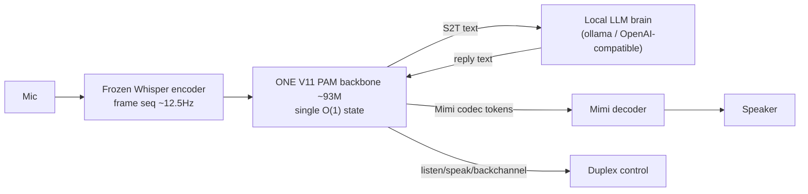

# V11 Full-Duplex Audio POC (parallel track)

> **Not speech-to-speech.** This line trains a **turn-taking controller** on the same V11
> PAM math as text LM — predict `<listen>`, `<speak>`, or `<backchannel>` from streaming
> audio embeddings. It does **not** generate reply speech (Stage 2+ may hook external TTS).

Runs **in parallel** with the main **~10B-token text pretrain** on the RTX PRO 6000.
All duplex code is **additive** under `v11/duplex/` — shared `v11/model.py`, `v11/train.py`,
and pretrain scripts are untouched.

---

## Parallel GPU layout (2026-06-30)

| Track | GPU | Job | Status |
|-------|-----|-----|--------|
| **Text knowledge pretrain** | RTX PRO 6000 | `v11_e3_k3_chat`, DCLM-Edu + FineWeb-Edu, ~10B tokens | **DONE** → `checkpoints_v11_e3_k3_chat_pretrain/best_model.pt` (WikiText val PPL 65.46) |
| **Text chat SFT** | RTX PRO 6000 | SmolTalk2 + `--warmstart_chatml` on 10B base | **DONE** → `checkpoints_v11_sft_chat_smoltalk/best_model.pt` (see [EXPERIMENTS_V11.md](../EXPERIMENTS_V11.md) recovery readout) |
| **Duplex audio POC** | RTX 4090 (local) | `duplex_5m` E3 K=3, frozen Whisper, Kathbath hi/gu | **Stage 1 done**; Gradio demo live |

Text pretrain: [`scripts/run_v11_pretrain_scratch.sh`](../../scripts/run_v11_pretrain_scratch.sh),
checkpoints `checkpoints_v11_e3_k3_chat_pretrain/`, resume via `latest.pt` every 5000 steps.

Duplex: [`scripts/run_v11_duplex_stage0.sh`](../../scripts/run_v11_duplex_stage0.sh),
[`scripts/run_v11_duplex_stage1.sh`](../../scripts/run_v11_duplex_stage1.sh),
Gradio [`scripts/run_v11_duplex_gradio.sh`](../../scripts/run_v11_duplex_gradio.sh).

**After 10B + SmolTalk SFT:** optional distill text knowledge from
`checkpoints_v11_sft_chat_smoltalk/best_model.pt` into `duplex_25m` or a 100M audio
adapter — duplex POC is **not blocked** on text chat finishing.

---

## What we are building (vs Moshi / PersonaPlex)

| Approach | This POC | PersonaPlex / Moshi |
|----------|----------|---------------------|
| Audio in vocab | **No** — codec-free embeddings | Mimi codec tokens in LM vocab |
| Backbone | V11 PAM E3 K=3 (~5M→10M) | ~7B transformer |
| Output (today) | **Thinking tokens** only | Discrete audio + text streams |
| Inference | O(1) fixed PAM state | KV cache or large model |
| Goal | **Mechanism proof**: barge-in / turn-taking | Production voice agent |

Inspired by **SALMONN-omni**: interleave environment + assistant stream **embeddings** with
explicit thinking tokens; audio never becomes thousands of codec IDs.

---

## Duplex math

### 1. Backbone — same PAM as V11 text LM

Per head, matrix state `S ∈ ℂ^{d×d}`, conjugate retrieval (unchanged from
[v11/EXPERIMENTS_V11.md](../EXPERIMENTS_V11.md)):

```text
Write:     S_t = γ_t · S_{t-1} + V_t ⊗ K_t*        # outer product; K* = complex conjugate
Retrieve:  Y_t = Σ_{k=1}^{K} e^{iφ_k(x_t)} · S_k · Q_t   # E3 K=3 multistate
Train:     chunked dual form O(T·C)
Infer:     recurrent O(1)/token, fixed state (no KV cache)
```

Duplex presets lock `n_states=3`, `decay_mode='head'`, `write_mode='additive'` — the
**proven** V11 winner; no E1/E2 dead ends.

### 2. Codec-free audio path (Stage 1)

Whisper is **encoder only**, frozen:

```text
waveform x[n]  →  resample to 16 kHz  →  Whisper encoder  →  h ∈ ℝ^{D}  (D=768 for small)
h  →  ComplexLinear(D → dim)  →  z_audio ∈ ℂ^{dim}  (stacked as [real, imag] channels)
```

Chunked ~1 s segments; up to 4 chunks per block. **No Whisper decoder** — not ASR, not TTS.

Injection into the LM (subclass `V11DuplexLM`, no edits to shared `V11LM`):

```text
z_t = Embed(token_id)           for text / control tokens
z_t = project_audio(h)          at positions after <env_mark>  (audio slots)
logits = LMHead(PAM_blocks(z))
```

Audio occupies **embedding positions**, not vocab IDs — keeps vocab at 512 for control + text
placeholders.

### 3. Interleaved time block (~160 ms target; ~1 s chunks in POC)

Per block the sequence is:

```text
<env_mark>  [audio_slot × N]  →  predict  <listen> | <speak> | <backchannel>
[optional <ast_mark> + assistant echo slots]
[optional reply text tokens if <speak>]
```

Training labels: CE only on **thinking tokens** (and reply tokens when present); audio slots
and env structure masked with `ignore_index=-100`.

```text
Loss = CrossEntropy(logits[:, t], labels[:, t+1])   on thinking (+ reply) positions
```

Random baseline for 3-way thinking: **33.3%**. Stage 0 uses **text token proxies** for
“user spoke”; Stage 1 uses **real Kathbath / LibriSpeech** waveforms.

### 4. What “100% thinking accuracy” means (and does not)

Hi/gu Stage 1: **val think_acc = 1.0** on 400 simulated duplex pairs (200 hi + 200 gu).
Pairs are **consecutive single-speaker clips** — not true dual-channel Fisher conversation.
Metric validates the **control head**, not open-domain Hindi/Gujarati dialogue quality.

---

## Scale ladder (`v11/duplex/config.py`)

| Preset | dim | layers | heads | K | ~params |
|--------|-----|--------|-------|---|--------|
| `duplex_5m` | 160 | 8 | 4 | 3 | **5.25M** |
| `duplex_10m` | 208 | 8 | 6 | 3 | **9.16M** |
| `duplex_25m` | 304 | 10 | 8 | 3 | **23.5M** |

Small vocab (512) so params sit in **PAM blocks**, not tied embeddings.

---

## Results log

| Stage | preset | data | metric | result | checkpoint / log |
|-------|--------|------|--------|--------|------------------|
| 0 synthetic | `duplex_5m` | text proxy, barge-in sim | val think_acc | **100%** | `checkpoints_v11_duplex_5m_stage0/` |
| 1 audio EN | `duplex_5m` | LibriSpeech + Whisper | val think_acc | **100%** | `checkpoints_v11_duplex_5m_stage1/` · `logs/v11/duplex_stage1_duplex_5m_20260624_114119.log` |
| 1 audio hi/gu | `duplex_5m` | Kathbath hindi+gujarati, 400 pairs, 10 ep | val think_acc | **100%** (ep2–10) | `checkpoints_v11_duplex_5m_stage1_hi_gu/best_model.pt` · `logs/v11/duplex_stage1_hi_gu_train.log` |

Hi/gu run: **232 s** wall, `save_every_steps=50` → resumable `latest.pt`.

---

## Code map (additive only)

```
v11/duplex/
  config.py       # duplex_5m / 10m / 25m presets (E3 K=3)
  model.py        # V11DuplexLM(V11LM): audio embed injection
  encoder.py      # FrozenWhisperEncoder + 16 kHz resample
  thinking.py     # listen / speak / backchannel vocab
  interleave.py   # synthetic duplex blocks
  audio_data.py   # LibriSpeech + Kathbath loaders
  train.py        # Stage 0
  train_stage1.py # Stage 1 + periodic checkpoints
  infer.py        # single-shot thinking prediction
  gradio_app.py   # checkpoint picker + mic demo
  probe.py        # synthetic barge-in probe
```

Plan doc (design notes): [`.cursor/plans/v11_duplex_audio_poc_9606141c.plan.md`](../../.cursor/plans/v11_duplex_audio_poc_9606141c.plan.md)

---

## Next steps (POC track)

1. **Gradio / probe** on held-out audio — confirm 100% metric isn’t train-set leakage.
2. **`duplex_10m`** rerun (same hi/gu data) — scaling curve.
3. **Better data** — Fisher dual-channel (LDC) or real overlap/barge-in; Kathbath is monolingual clips only.

---

# Voice Interface Model (hi/gu/en) — Stages A–D  ·  2026-07-07

The POC above only predicts `listen/speak/backchannel`. This track evolves the **same
PAM backbone** into a real speech interface: streaming **S2T** (feeds an external LLM
"brain") + streaming **T2S** (speaks the brain's reply as Mimi codec tokens), keeping the
duplex control. Plan: [`.cursor/plans/duplex_voice_interface_model_7c3124dc.plan.md`].



## Key facts

- **ONE model, not two.** Stage A/B/C are a *training curriculum* on the same
  `duplex_100m` backbone + same unified vocab, not separate networks. Stage B warm-starts
  from Stage A (`--init_from`), Stage C from A+B (`--init_asr`/`--init_tts`). Final artifact:
  a single `duplex_100m` checkpoint that does S2T, T2S, and control. (See FAQ below.)
- **Unified vocab ~40,208** (`tokenizer.py`): 16 control + 32,000 SentencePiece (hi/gu/en,
  `byte_fallback`) + 4×2048 Mimi codec. Text + codec share the tied embedding/LM head.
- **Backbone** `duplex_100m` = proven `v11_e3_k3` geometry (16×384, K=3, content-aware gate,
  chunk 256). Built: **92.83M** params (embedding 30.88M, blocks 61.65M).
- **Speech in** = frozen `whisper-small` **frame sequence** stride-4 → ~12.5 Hz (not the POC's
  1-vec/s mean-pool), injected as complex embeddings at `<audio_pad>` slots.
- **Speech out** = frozen `kyutai/mimi` (24 kHz, 12.5 Hz), first 4 codebooks, **delay pattern**.

## Stages (each independently gated on the 4090)

| Stage | file | task | gate (metric) |
|-------|------|------|---------------|
| A | `train_asr.py` | S2T (ASR): `<env>[audio]<transcribe><lang> text <eos>` | held-out **CER** (target <15%) |
| B | `train_tts.py` | T2S: `<lang> text <tts> [codec] <eos>`; `--task both` reuses each pair S2T+T2S | **round-trip WER** (Whisper on generated audio) |
| B* | `train_tts.py --task roundtrip` | `[audio]<transcribe> text <tts> codec-of-same-audio` | **ablation only** (copy-shortcut risk); keep only if it beats plain mix |
| C | `train_duplex_v2.py` | interleaved S2T + reply text + T2S + control + barge-in, init from A+B | bucketed **control / text / codec** next-token acc |
| D | `infer_stream.py` | streaming session: block loop, one PAM state, barge-in, brain | qualitative (Gradio voice tab) |

Sequence layouts and loss masks are documented in each file's docstring. All trainers share
crash-safe `latest.pt` resume, cosine LR + warmup, bf16 autocast, SIGTERM/SIGINT save.

## Data reuse (core recipe)

Each `(audio, text)` pair → **two samples**: `[audio]<transcribe>text` (S2T) and
`text<tts>codec` (T2S). Standard, low-risk, and it makes scarce **Gujarati** data train
understanding *and* speaking. Kathbath hi/gu (noisy/multi-speaker) covers both; clean
single-speaker corpora (IndicTTS/Rasa, LibriTTS-R) should be added via extra rows for output
voice quality. The single-sequence round-trip autoencoder is a **later ablation only**.

## Launch order

Logs follow the same per-run folder layout as text V11 training:
`logs/v11/<run_name>_<YYYYMMDD_HHMMSS>_<gitsha>[_dirty]/` with `RUN_INFO.txt` +
`duplex_*.log` inside (see `scripts/log_utils.sh`). Resume reuses the folder via
`<ckpt_dir>/last_log_dir.txt`.

```bash
./scripts/run_v11_duplex_tokenizer.sh    # once: unified hi/gu/en + codec vocab
./scripts/run_v11_duplex_asr.sh          # Stage A  -> gate CER
./scripts/run_v11_duplex_tts.sh          # Stage B  -> gate round-trip WER  (inits from A)
./scripts/run_v11_duplex_v2.sh           # Stage C  -> joint duplex          (inits from A+B)
# Stage D (talk to it):
uv run python -m v11.duplex.infer_stream \
    --checkpoint checkpoints_v11_duplex_100m_duplex_v2/best_model.pt \
    --audio in.wav --lang hindi --brain
./scripts/run_v11_duplex_gradio.sh       # "Voice interface" tab
```

Brain = any OpenAI-compatible endpoint (`brain.py`): ollama / llama.cpp / vLLM. Start with
Qwen2.5-3B-Instruct or Sarvam-1 (strong Hindi). `BRAIN_BASE_URL`, `BRAIN_MODEL` env vars.

## Architecture FAQ (why one model + memory)

**Q: Is this two PAM models (one ASR, one TTS) or one?**
One. `train_asr.py` and `train_tts.py` are separate *scripts* for a staged curriculum, but
they train the **same architecture and vocab**; B initializes from A, C from A+B. At
inference (`infer_stream.DuplexSession`) the single model runs S2T, then the external LLM
produces reply text, then the **same model resumes** with T2S — the PAM state is threaded
across that boundary (`self.states`, `self.step`). So it is "one model with an intermediate
brain value, then resume", exactly.

**Q: Does the LLM see the whole conversation, or do we need a mechanism outside the model to
merge old chat with new?**
The mechanism already exists and lives **outside** the PAM model, in `brain.Conversation`:
every user transcript and every assistant reply is appended to a text message list, and the
**full history is sent to the LLM each turn** (system + all turns). The LLM is not starved —
long-conversation recall is guaranteed by the brain's text context, not by the 100M state.
(For very long chats, add optional summarization/compaction on top — not required for a demo.)

**Q: Two memory layers — which holds what?**

| Layer | Holds | Used for | Persistence |
|-------|-------|----------|-------------|
| **LLM brain text context** (`Conversation`) | verbatim transcripts + replies | semantic recall, reasoning | whole session (grows as text) |
| **PAM recurrent state** | acoustic / conversational **gist** | turn-taking, barge-in, backchannel timing, prosodic continuity within a turn | O(1) fixed size, streamed across blocks |

The PAM state is **deliberately not** the semantic memory — it is fixed-size and small; that
job is the LLM's.

**Q: If it's "just ASR + TTS + external LLM", why the single PAM model and why memory at all?
Why not cascade Whisper → LLM → an off-the-shelf TTS?**
For strict **turn-based** Q&A, a cascade would indeed be simpler and the PAM model's edge is
mainly latency/unification. The single streaming model earns its place only for **full-duplex
behavior**, which a stateless cascade fundamentally cannot do:

- **Listen while speaking** — the time-multiplexed block loop carries incoming mic frames and
  outgoing codec in the *same* O(1) state, so the model keeps hearing the user mid-reply.
- **Sub-second barge-in** — control can flip to `<listen>` and truncate codec emission the
  instant the user interrupts (`interrupt_check`), instead of finishing a TTS utterance.
- **Backchannels / turn detection** — `listen/speak/backchannel` decided continuously from the
  live state, not after a full ASR turn ends.
- **Prosodic/acoustic conditioning** — the reply is shaped by *how* the user spoke, carried in
  the state, not just the transcribed words.
- **Streaming latency** — O(1)/token, no re-encoding a growing context window.

So: **memory (the PAM state) is needed for the duplex/streaming behavior, not for semantic
recall**; semantic recall is the LLM's text context. If you only ever want polite turn-taking
with no overlap or barge-in, the model's advantage shrinks — the value is realized in live,
interruptible, overlapping conversation.

## Code map (voice-interface additions)

```
v11/duplex/
  tokenizer.py        # DuplexVocab (unified id-space) + SentencePiece hi/gu/en
  encoder.py          # + encode_frames(): ~12.5 Hz frame sequence
  config.py           # + duplex_100m preset (~40k vocab, v11_e3_k3 geometry)
  codec.py            # Mimi encode/decode + delay-pattern flatten/unflatten
  train_asr.py        # Stage A (S2T), CER gate, greedy state-carry decode
  train_tts.py        # Stage B (T2S / both / roundtrip-ablation), round-trip WER
  brain.py            # OpenAI-compatible client + Conversation + dataset builder
  train_duplex_v2.py  # Stage C joint interleaved (S2T+T2S+control+barge-in)
  infer_stream.py     # Stage D DuplexSession: block loop, state carry, barge-in
  gradio_app.py       # + "Voice interface" tab (mic -> transcript -> LLM -> speech)
```

Validated offline (tiny model + real Mimi + synthetic tokenizer): tokenizer roundtrip, codec
delay roundtrip, all stage sample-builders + forward/loss/backward, constrained codec
generation, barge-in truncation, full `converse`. `v11/duplex/selftest.py` = **12/12 pass**
(added `test_audio_proj_receives_gradients`, `test_ctc_head_learns`).

## Stage A (ASR) training runs

Gate: held-out **CER < 15%** on the multilingual val set before Stage B.

### Run 1 — `checkpoints_v11_duplex_100m_asr` (BROKEN, negative control)

2k/lang hi+gu + 2k en (6000 utts), 10 epochs, batch 6, ~25 min. **FAILED gate.**

| epoch | train_loss | val_loss | CER |
|-------|-----------|----------|-----|
| 1 | 7.72 | 6.92 | 1.058 |
| 8 (best) | 4.34 | 6.96 | **0.732** |
| 10 | 4.04 | **7.06** (rising) | 0.742 |

Root cause: `project_audio` ran under `torch.no_grad()` in the train loop, so the
trainable audio projection stayed at random init — the backbone only learned text
priors. Tell-tale signature: train_loss falls while **val_loss rises** and CER is flat.
Discard this checkpoint; keep only as a negative control.

### Fix

Moved `project_audio` inside the grad-enabled autocast block in `train_asr.py`,
`train_duplex_v2.py` (S2T batches), `train_tts.py` (audio tasks). The frozen Whisper
frames are still precomputed under `no_grad` upstream (encoder stays frozen); only the
trainable projection now receives gradients. Guarded by
`selftest.test_audio_proj_receives_gradients`. Added per-lang CER, ref/hyp samples, and
an `audio_grad` norm to the epoch log to catch a regression immediately.

### Run 2 — `checkpoints_v11_duplex_100m_asr_v2` (smoke, fix validated)

Same 6000 utts, 5 epochs, batch 6, ~13 min. Purpose: confirm the fix makes the audio
path learn.

| epoch | train_loss | val_loss | CER | en / gu / hi | audio_grad |
|-------|-----------|----------|-----|--------------|------------|
| 1 | 7.87 | 7.07 | 2.069 | 0.735 / 4.244 / 0.798 | 0.204 |
| 3 | 6.01 | 6.49 | 0.872 | 0.694 / 1.101 / 0.784 | 0.430 |
| 4 (best) | 5.60 | 6.48 | **0.753** | 0.708 / 0.788 / 0.761 | 0.335 |
| 5 | 5.34 | 6.50 | 0.757 | 0.708 / 0.786 / 0.779 | 0.426 |

Verdict: **fix confirmed.** `audio_grad > 0` every epoch and **val_loss now decreases**
(7.07 → 6.48) — the opposite of the broken run. But 5 epochs / 2k-per-lang / fully-decayed
cosine LR is far too little: output is still degenerate repetition of common function
words ("इससे इससे भी भी", "આ ઘટનાની આ ઘટનાની"), so absolute CER (0.75) is not yet usable.
Proceed to a scaled run for the real CER measurement.

### Run 3 — scaled (`checkpoints_v11_duplex_100m_asr_v2`, stopped early)

4k/lang hi+gu + 4k en (12000 utts), 15 epochs planned, batch 8, ~40 min to ep10.
**FAILED gate** — same ~0.73 CER plateau despite 2× data.

| epoch | train_loss | val_loss | CER | en / gu / hi |
|-------|-----------|----------|-----|--------------|
| 3 | 5.78 | 6.07 | 0.734 | 0.70 / 0.75 / 0.76 |
| 5 | 5.13 | **6.00 (min)** | 1.052 | 1.50 / 0.75 / 0.74 |
| 8 (best) | 4.20 | 6.13 | **0.727** | 0.73 / 0.75 / 0.71 |
| 10 | 3.54 | **6.36** (rising) | 0.740 | 0.74 / 0.75 / 0.74 |

Epoch-10 hyps are **fluent but unrelated to audio** (LM hallucination):
- hi ref `किसानों ने राजभवन के सामने भी आलू फेंका है` → hyp `सरकार ने इस बार पुलिस को भी एक बार आ रहे हैं`
- en ref `...never been a ghost nor used a wooden leg...` → hyp `who has been a good deal to get it in a smile and tender as well as well as...`

**Grounding diagnosis:** not a data/epoch problem. PAM is a decaying associative memory
(`S_t = γ_t·S_{t-1} + V_t⊗K_t*`) with no mechanism for text steps to **re-read** individual
audio frames (unlike Transformer cross-attention). The AR objective never forces precise
audio use; the model learns a strong text LM and generates plausible sentences
unconditionally. Signature: train_loss ↓, val_loss ↑ after ~epoch 5, CER flat ~0.73.

### Fix 2 — hybrid CTC head on audio-frame hiddens

Add `FrameHeads.ctc_head` on the shared post-norm audio hidden (real+imag → `2*dim` →
`n_text+1` with blank). Joint loss: `ar_loss + λ·ctc_loss` (`--ctc_weight`, default 0.5).
CTC forces per-frame phonetic alignment; cannot be satisfied by a language-model prior.
Eval reports both AR-greedy CER and **CTC-greedy CER** (the grounded metric). Model now
~117M params (base 93M + ~25M CTC head + audio proj). Reserved hooks for Phase 2
`vad_head` (speech/noise) and Phase 3 `speaker_head` + `cond_vec` (target-speaker
conditioning) on the same hidden — structurally built-in, trained later.

### Run 4 — CTC smoke (`checkpoints_v11_duplex_100m_asr_ctc`, done)

2k/lang + 2k en, 6 epochs, batch 6, `ctc_weight=0.5`, ~17 min.
Log: `logs/v11/duplex_asr_duplex_100m_20260707_171322_df09fa7_dirty/`

| epoch | train_loss | ctc_loss | CER | ctc_CER | en_ctc / gu_ctc / hi_ctc |
|-------|-----------|----------|-----|---------|---------------------------|
| 1 | 12.62 | 8.03 | 1.690 | 0.905 | 0.858 / 0.948 / 0.904 |
| 3 | 10.22 | 6.85 | 0.758 | 0.755 | 0.818 / 0.759 / 0.673 |
| 5 (best) | 8.64 | 5.91 | 0.742 | **0.661** | 0.639 / 0.686 / 0.654 |
| 6 | 8.30 | 5.86 | 0.739 | 0.671 | 0.650 / 0.695 / 0.663 |

Verdict: **CTC grounding confirmed.** `ctc_CER` fell 0.905 → 0.661 (below the old ~0.73
AR plateau). CTC hyps show real word overlap (e.g. hi `बताया के चुनाव क्षेत्र`, gu
`ભારત વીડિયોની એક ઘટના`) while AR hyps remain LM-degenerate (`इससे यह यह भी भी`).
`ctc_loss` and `val_loss` both decrease; `audio_grad` ~1.5. Gate <15% not yet met —
proceed to scaled run.

### Run 5 — CTC scaled (`checkpoints_v11_duplex_100m_asr_ctc`, in progress)

4k/lang + 4k en, 15 epochs, batch 8, `ctc_weight=0.5`. Target: gate CER/ctc_CER < 15%.

## Speaker / noise robustness (staged — focus on main speaker)

Frozen Whisper mixes all sources (noise-robust, not speaker-separating). Realistic path:
**per-frame heads + speaker conditioning** on the shared audio hidden, not full source
separation (SepFormer/VoiceFilter would be a separate front-end).

| Phase | head | data | purpose |
|-------|------|------|---------|
| 1 (now) | `ctc_head` | clean Kathbath + LibriSpeech | acoustic grounding / ASR |
| 2 (later) | `vad_head` (speech/noise) | + MUSAN noise augmentation | robustness + turn detection |
| 3 (later) | `speaker_head` + `cond_vec` | simulated 2-speaker mixtures (LibriMix-style) + enrollment embedding (ECAPA/WavLM) | target-speaker ASR; suppress background talkers |

Sequencing: separation is premature until clean-audio CTC grounding passes. Hooks reserved
in `FrameHeads` + `cond_vec` plumbing from the start.

## Status / next steps (voice track)

- [x] Tokenizer, encoder frames, `duplex_100m` preset, codec, Stages A–D code + scripts, tests.
- [x] Tokenizer trained on Kathbath hi/gu + LibriSpeech (vocab 40208).
- [x] Stage A run 1 (no_grad audio bug) → fix 1 (audio_grad) → run 2 smoke validated.
- [x] Stage A run 3 scaled → plateau ~0.73, LM hallucination diagnosed.
- [x] Fix 2: hybrid CTC head + joint loss + dual CER eval.
- [x] Stage A run 4 (CTC smoke) → grounding confirmed, best ctc_CER=0.661.
- [ ] Stage A run 5 (CTC scaled, 4k/lang, 15 ep) → gate <15% before Stage B.
- [ ] Stage B training run (`--task both`) → record round-trip WER here.
- [ ] Stage C joint run → record control/text/codec acc here.
- [ ] Phase 2: VAD/noise head + MUSAN augmentation.
- [ ] Phase 3: target-speaker conditioning + interferer head.
- [ ] Add clean single-speaker TTS corpora (IndicTTS/Rasa, LibriTTS-R) for output voice.
- [ ] Optional: distill `v11_e3_k3_chat` text knowledge to reduce brain dependence.
