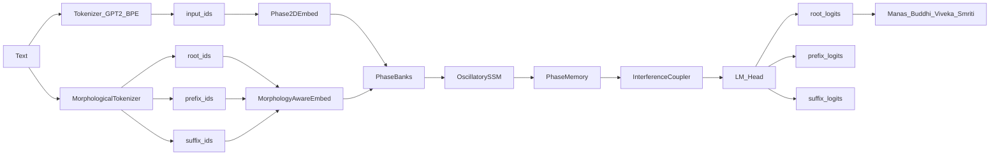

# v4 Quantum Phase-Field LLM

A novel language model architecture combining quantum-inspired phase representations with GPU-practical implementations. **Designed for consumer-grade GPUs like RTX 4090.**

> **IMPORTANT: Byte Tokenizer is the Recommended Approach**
> 
> After experimentation, we've settled on **byte tokenizer** as the primary tokenization strategy. The morphological tokenizer and specialized banks (morphology, orthography) were experimental and did not provide sufficient benefit over the simpler byte-level approach. The byte tokenizer:
> - Works universally across all languages (UTF-8)
> - Has a tiny vocab (259 tokens) reducing embedding overhead
> - Pairs well with byte patching for efficient processing
> - Uses only 2 banks (semantic + context) which is faster and equally effective

## Key Innovation

Unlike traditional transformers or even v2/v3, v4 uses:

- **Phase2D Representation**: Complex numbers as 2D real vectors (no sin/cos in hot path)
- **Byte Tokenizer + Patching**: Raw UTF-8 bytes grouped into patches for efficiency
- **Dynamic Phase Bank Interference**: Semantic + Context banks with learned per-token routing
- **Oscillatory SSM Backbone**: Linear-time O(n) sequence processing via coupled oscillators
- **Dual Memory System**: Global associative memory + Episodic buffer for copy capability
- **Injectable Architecture**: All components swappable via registry/config

## Quick Start

```bash
cd v4

# Run tests to validate everything works
uv run python test_v4.py

# RECOMMENDED: Train with byte tokenizer on RTX 4090
uv run python train_real.py \
  --dataset tinystories \
  --size medium-byte \
  --tokenizer byte \
  --byte_patching \
  --max_length 256 \
  --batch_size 16 \
  --epochs 50

# Smaller model for quick experiments
uv run python train_real.py \
  --dataset tinystories \
  --size small-byte \
  --tokenizer byte \
  --byte_patching \
  --epochs 10
```

---

## Archived/Experimental Features

> **Note**: The following features were experimental explorations. We've found that the **byte tokenizer with 2 banks (semantic + context)** is more effective and faster. These are kept for reference but are not recommended for new training runs.

<details>
<summary><b>Morphological Tokenizer (Experimental - Not Recommended)</b></summary>

Data-driven tokenizer that learns root and affix vocabularies from corpus statistics:

```python
from v4.data import MorphologicalTokenizer, get_tokenizer

# Train morphological tokenizer
tokenizer = get_tokenizer(
    tokenizer_type='morphological',
    morph_train_texts=train_texts,
    morph_path='tokenizer_cache/'
)

# Encode returns (root_ids, prefix_ids, suffix_ids)
result = tokenizer.encode("walking quickly")
print(result['root_ids'])    # [walk, quick]
print(result['prefix_ids'])  # [<null>, <null>]
print(result['suffix_ids'])  # [ing, ly]
```

The morphological embedding applies phase rotations:
- **Root**: Base Phase2D vector (core meaning)
- **Prefix**: Pre-rotation operator (semantic modifier)
- **Suffix**: Post-rotation operator (grammatical role)

```python
# Math: z = RotateSuffix(suffix) ⊙ RotatePrefix(prefix) ⊙ EmbedRoot(root)
```

### Full Text Generation (v4.2)

The model now predicts **all three components** (root + prefix + suffix) for complete morphological text generation:

**Architecture:**
```
backbone_out → lm_head → root_logits (16K vocab)
            → prefix_proj → prefix_logits (2K vocab)
            → suffix_proj → suffix_logits (2K vocab)
```

**Training:** The model learns to predict roots (primary) and affixes (secondary with 0.3 weight):
```python
# Automatic in train_real.py with --tokenizer morphological
loss = ce_loss(root_logits, root_targets) + 0.3 * (
    ce_loss(prefix_logits, prefix_targets) +
    ce_loss(suffix_logits, suffix_targets)
)
```

**Generation:** Returns full morphological tuples:
```python
# Generate returns (root_ids, prefix_ids, suffix_ids) for morphological mode
generated = model.generate(
    root_ids=roots, prefix_ids=prefixes, suffix_ids=suffixes,
    max_new_tokens=50
)
gen_roots, gen_prefixes, gen_suffixes = generated

# Decode with full reconstruction
text = tokenizer.decode(
    gen_roots[0], 
    prefix_ids=gen_prefixes[0],
    suffix_ids=gen_suffixes[0]
)
# "The quickly running dog jumped happily"
```

### Morphological Tokenizer Quality & Speed (v4.3)

The morphological tokenizer has been improved for better quality and speed:

**Quality Improvements:**
- Roots are now primarily **full words** (not short n-grams)
- Affixes are selected by **productivity** (how many stems they attach to)
- Punctuation is tokenized separately with proper spacing on decode
- `min_root_len` increased to 3 to avoid single-char roots

**Speed Improvements:**
- **O(L²) parsing** instead of O(|P|·|S|) - bounded affix-length search
- **Word-level parse cache** - repeated words hit cache (100K default size)
- **Pruned n-gram counting** - only top-K words used for n-gram extraction

**Configuration:**
```python
from v4.data.morphological_tokenizer import MorphologicalTokenizerConfig

config = MorphologicalTokenizerConfig(
    root_vocab_size=16000,      # Total root vocabulary
    prefix_vocab_size=512,      # Smaller for quality
    suffix_vocab_size=512,      # Smaller for quality
    min_root_len=3,             # Avoid single-char roots
    max_affix_len=5,            # Max prefix/suffix length
    min_freq=5,                 # Min frequency to include
    parse_cache_size=100000,    # Word parse cache size (0 to disable)
    top_k_words_for_ngrams=10000,  # Top-K words for n-gram extraction
    min_affix_productivity=3,   # Min stems per affix
    word_priority_ratio=0.7,    # Fill 70% of vocab with full words first
)
```

**Cache Reset (when changing tokenizer settings):**
```bash
# Delete tokenizer cache (forces retraining)
rm -rf .cache/morph_tokenizer

# Delete token caches (forces re-tokenization)
rm -rf .cache/tokens/*_morph.pt
```

**Training Tips:**
- Use more training samples for tokenizer training (e.g., `--max_train_samples 50000`)
- The tokenizer trains once and is cached; model training uses the cached tokenizer

</details>

---

## Current Architecture (v4.4)

### Dynamic Coupling + Episodic Memory + Speed Optimizations

Major architectural improvements focused on quality AND speed:

**Quality Improvements:**

1. **Dynamic Coupler Routing**: Per-token bank weights instead of static mixing
   - Each token decides which banks are most relevant
   - Gives transformer-like dynamic interaction without O(n²)
   - Implemented via cheap magnitude-based routing (tiny MLP)

2. **Episodic Memory (Copy Capability)**: Ring buffer for within-sequence retrieval
   - Addresses transformer's biggest advantage: exact copy/retrieval
   - Each position attends to recent positions via windowed attention
   - O(n × buffer_size) instead of O(n²)

3. **Fixed Semantic Coherence**: Real phase coherence for concept attention
   - Was using heuristic (query + bias), now uses actual coherence
   - Better concept retrieval from learned memory

4. **Diversity-Aware Coupling Loss**: Banks encouraged to capture different aspects
   - Old: all banks align (leads to collapse)
   - New: encourage variance in coherence (some align, some oppose)

**Speed Improvements:**

5. **Byte-Optimized Configs**: New `*-byte` model sizes
   ```bash
   # Use medium-byte instead of medium for byte tokenizer
   python train_real.py --size medium-byte --tokenizer byte ...
   ```
   - Only 2 banks (semantic + context) vs 4 banks
   - Smaller memory (512 slots vs 1024)
   - ~50% faster bank computation

6. **Removed Expensive cross_proj**: Coupler no longer concatenates all banks
   - Was: O(batch × seq × dim × num_banks × dim)
   - Now: O(batch × seq × dim)

7. **Reduced Memory top_k**: 32 instead of 64 slots per query

**Byte Model Sizes:**
| Size | Dim | Layers | Banks | Params | Use Case |
|------|-----|--------|-------|--------|----------|
| tiny-byte | 64 | 4 | 2 | ~1M | Testing |
| small-byte | 256 | 8 | 2 | ~10M | Quick experiments |
| medium-byte | 512 | 12 | 2 | ~177M | RTX 4090 training |
| large-byte | 768 | 16 | 2 | ~350M | A100 training |

**Example Commands:**
```bash
# Fast training on RTX 4090 (byte tokenizer + optimized config)
uv run python v4/train_real.py \
  --dataset tinystories \
  --size medium-byte \
  --tokenizer byte \
  --byte_patching \
  --max_length 256 \
  --batch_size 16 \
  --epochs 50

# Compare: original medium (slower, more banks)
uv run python v4/train_real.py \
  --dataset tinystories \
  --size medium \
  --tokenizer byte \
  --byte_patching \
  --max_length 256 \
  --batch_size 12 \
  --epochs 50
```

<details>
<summary><b>Extra Phase Banks (Experimental - Not Effective with Byte Tokenizer)</b></summary>

> **Note**: These banks were designed for BPE/morphological tokenization. With byte tokenizer, they don't provide meaningful benefit since individual bytes don't carry morphological or orthographic information. **Use `*-byte` configs which only include semantic + context banks.**

**MorphologyPhaseBank**: Focuses on grammatical transformations
```python
# NOT recommended with byte tokenizer
config.banks['morphology'] = BankConfig(type='morphology', dim=256)
```

**OrthographyPhaseBank**: Learns script/shape patterns for multilingual support
```python
# NOT recommended with byte tokenizer
config.banks['orthography'] = BankConfig(type='orthography', dim=256)
```

</details>

### Philosophy Metrics

Inspired by Indian philosophical concepts:

| Metric | Concept | Measures |
|--------|---------|----------|
| **Manas** (मनस्) | Active mind | Backbone state magnitude/entropy |
| **Buddhi** (बुद्धि) | Discernment | Logit confidence/margin |
| **Viveka** (विवेक) | Stability | Phase coherence/energy |
| **Smriti** (स्मृति) | Memory | Attention sharpness/hit rate |

Enable during training:
```python
# In forward pass
output = model(input_ids, context={'compute_metrics': True})
print(output.metrics)  # {'manas/magnitude': 0.5, 'buddhi/confidence': 0.8, ...}
```

### 4. Speed & Memory Optimizations

**Memory-efficient attention**: The memory module now uses einsum-based attention computation, reducing memory usage from O(batch × seq × slots × dim) to O(batch × seq × slots).

**Reduced default memory slots**: Small/Medium configs now use fewer memory slots (512/1024) for consumer GPU compatibility.

```bash
# Enable torch.compile
uv run python train_real.py --compile --compile_mode reduce-overhead

# Use more dataloader workers
uv run python train_real.py --num_workers 8

# Enable token caching (default: on)
uv run python train_real.py --cache_dir .cache/tokens

# Vectorized scan in backbone (default: on)
# Enabled automatically; pre-computes projections for faster recurrence
```

## A/B Testing: BPE vs Morphological

Switch between tokenization modes:

```python
from v4 import create_model, V4Config
from v4.core.config import TokenizerConfig

# BPE mode (default)
config = V4Config(
    tokenizer=TokenizerConfig(mode='bpe', bpe_name='gpt2')
)

# Morphological mode
config = V4Config(
    tokenizer=TokenizerConfig(
        mode='morphological',
        root_vocab_size=16000,
        prefix_vocab_size=2000,
        suffix_vocab_size=2000,
    )
)

model = create_model(config=config)

# Switch mode at runtime
model.set_embedding_mode('bpe')  # or 'morphological'
```

### Byte-Level Tokenizer (Multilingual, Tokenizer-Free)

The **byte tokenizer** (`--tokenizer byte`) uses raw UTF-8 bytes as tokens:
- **Vocab size**: 259 (256 bytes + 3 specials: pad/bos/eos)
- **Multilingual**: Works with any language/script without training
- **Tokenizer-free**: No learned segmentation; the model learns structure end-to-end

```bash
# UTF-8 byte-level training (multilingual)
uv run python train_real.py \
  --dataset tinystories \
  --size small \
  --epochs 5 \
  --tokenizer byte \
  --max_length 1024 \
  --batch_size 64 \
  --cache_dir .cache/tokens_byte
```

**Trade-offs:**
- Sequences are ~4x longer than word-level tokenizers
- **With linear backbone ($O(N)$):** Scales better than quadratic attention models
- Model learns character/word boundaries implicitly through phase interference
- Perfect for testing quantum-inspired phase dynamics without tokenizer artifacts

**Performance Notes:**
- **Speed:** 15-18 samples/sec with batch_size=64 (excellent for long contexts)
- **Memory:** Use larger batches (64) since sequences are longer but backbone is efficient
- **Learning:** Model learns spelling → morphology → semantics → syntax hierarchy
- **Multilingual:** Zero-shot capability for any UTF-8 script (Arabic, Chinese, etc.)

### Byte Patching (v4.4) - Fast Byte-Level Training

**Problem:** Byte-level training has ~4x longer sequences than word tokenizers, making compute expensive.

**Solution:** **Fixed-size byte patching** groups P=4 bytes into patch latents. The backbone operates on L=T/4 patches instead of T bytes, reducing compute by 4x while preserving byte-level objectives.

```mermaid
flowchart LR
    bytes[ByteIDs_T] --> patcher[BytePatcher_P4]
    patcher --> patchLatents[PatchLatents_L]
    patchLatents --> banks[PhaseBanks]
    banks --> backbone[OscillatorySSM_L]
    backbone --> memory[PhaseAssociativeMemory]
    memory --> patchOut[PatchStates_L]
    patchOut --> byteDecoder[WithinPatchByteDecoder]
    byteDecoder --> logits[ByteLogits_Tx259]
```



**Usage:**
```bash
# Full byte-patching training (recommended)
uv run python v4/train_real.py \
  --dataset tinystories \
  --size medium \
  --tokenizer byte \
  --byte_patching \
  --byte_patch_size 4 \
  --byte_decoder_layers 2 \
  --max_length 1024 \
  --batch_size 8 \
  --num_workers 4 \
  --epochs 50 \
  --cache_dir .cache/tokens_byte_p4_medium \
  --checkpoint_dir checkpoints_v4_byte_patched_medium

# With longer context (backbone sees 512 patches for 2048 bytes)
uv run python v4/train_real.py \
  --dataset tinystories \
  --size medium \
  --tokenizer byte \
  --byte_patching \
  --max_length 2048 \
  --batch_size 16 \
  --epochs 50 \
  --cache_dir .cache/tokens_byte_p4_2k \
  --checkpoint_dir checkpoints_v4_byte_patched_2k

# Disable patching for comparison (slower, uses full byte sequences)
uv run python v4/train_real.py \
  --dataset tinystories \
  --size medium \
  --tokenizer byte \
  --no_byte_patching \
  --max_length 1024 \
  --batch_size 8
```

**Effective sequence lengths:**
| max_length | patch_size | Backbone sees | Memory savings |
|------------|------------|---------------|----------------|
| 1024 bytes | 4 | 256 patches | 4x |
| 2048 bytes | 4 | 512 patches | 4x |
| 4096 bytes | 4 | 1024 patches | 4x |

With patching, you can increase `--batch_size` (try 16-32) or `--max_length` (try 2048-4096) since the backbone processes 4x shorter sequences.

**If you still hit CUDA OOM (common with `--size medium`):**
- Lower `--batch_size` first (e.g. 16 → 8 → 4). This is the biggest lever.
- Keep `--max_length 1024` until it’s stable, then scale up.
- Enable compile: `--compile --compile_mode reduce-overhead` (often reduces peak memory after warmup).
- If you just changed settings, use a fresh `--cache_dir` (so old cached shapes don’t surprise you).
- Note: v4 includes **bank coupling loss** by default for multi-bank configs; it's sequence-pooled to avoid OOM.

**How it works:**
1. **BytePatcher**: Converts byte IDs [B, T] → patch latents [B, L, dim, 2] using learnable position-weighted aggregation
2. **Backbone/Banks/Memory**: Process patch latents at reduced sequence length (L = T/4)
3. **WithinPatchByteDecoder**: Converts patch states back to per-byte logits [B, T, 259] using teacher-forced causal decoding within each patch

**Performance (RTX 4090):**
- **4x faster** training vs non-patched byte mode
- **True byte-level CE loss** preserved (predictions at every byte position)
- **Generation:** Patch-by-patch with autoregressive byte decoding within patches

### Memory Scaling (v4.4) - Chunked Top-K Retrieval

**Problem:** The memory module computed [batch*seq, num_slots] coherence matrices, causing OOM with large memories.

**Solution:** **Chunked top-k retrieval** processes keys in chunks (2048 at a time), maintaining running top-k without materializing the full matrix.

```python
# Old: O(batch*seq * num_slots) memory
coherence = einsum('qd,nd->qn', query, keys)  # [batch*seq, num_slots] - OOM!

# New: O(batch*seq * top_k) memory
# Streams through key chunks, maintains running top-k per query
for chunk in key_chunks:
    chunk_coherence = einsum(...)
    update_running_topk(chunk_coherence, chunk_indices)
softmax_over_topk()  # Only top-k values stored
```

**Result:** 
- **10x memory reduction** for large memory configurations
- Default `top_k=64` captures relevant memories
- Use `use_sparse=True` (default) for best efficiency
- Use `use_sparse=False` for debugging (returns full attention)

### Simple char-level tokenizer (ASCII baseline)

For quick architecture tests with ASCII-only text:

```bash
uv run python train_real.py --dataset tinystories --size tiny --epochs 1 --tokenizer simple
```

## Architecture Overview



### Components

| Component | Description | Implementation |
|-----------|-------------|----------------|
| **Phase2D** | Complex numbers as [real, imag] pairs | `core/phase2d.py` |
| **DualEmbedding** | BPE or Morphological embedding | `core/morphology_embed.py` |
| **PhaseBanks** | Semantic/Context/Language/Morphology/Orthography | `banks/` |
| **Backbone** | Oscillatory SSM (with scan option) | `backbone/oscillatory_ssm.py` |
| **Coupler** | Interference-based mixing | `coupler/interference.py` |
| **Memory** | Phase-coded associative memory | `memory/phase_associative.py` |
| **Metrics** | Philosophy-aligned metrics | `metrics/` |

## Phase2D: The Core Math

Instead of using sin/cos for phase operations (slow on GPU), we represent complex numbers as 2D vectors:

```python
# Complex number z = a + bi represented as
z = torch.tensor([a, b])  # shape: [..., 2]

# Multiplication by i (90° rotation)
i * z = torch.tensor([-b, a])  # Just swap and negate!

# Rotation via Cayley transform (no trig!)
cos_like = (1 - a²) / (1 + a²)
sin_like = (2a) / (1 + a²)
```

All operations reduce to matrix multiplies (GEMM) - perfect for Tensor Cores.

## Injectable Architecture

Every component can be swapped via config:

```python
from v4.core.config import V4Config, BankConfig

config = V4Config(
    dim=256,
    banks={
        'semantic': BankConfig(type='semantic', dim=256),
        'context': BankConfig(type='context', dim=256),
        'morphology': BankConfig(type='morphology', dim=256),
        'orthography': BankConfig(type='orthography', dim=256),
    },
)
```

Register new components with decorators:

```python
from v4.core.registry import register_bank

@register_bank('my_custom_bank', description='My custom phase bank')
class MyCustomBank(nn.Module, PhaseBank):
    ...
```

## Model Sizes

| Size | Dim | Layers | Params | Use Case |
|------|-----|--------|--------|----------|
| tiny | 64 | 4 | ~1M | Testing |
| small | 256 | 8 | ~10M | Quick experiments |
| medium | 512 | 12 | ~50M | Balanced |
| large | 768 | 16 | ~200M | Production |

## Training

### With Speed Optimizations

```bash
# Full speed training
uv run python train_real.py \
    --dataset tinystories \
    --size small \
    --epochs 20 \
    --compile \
    --num_workers 8 \
    --cache_dir .cache/tokens

# Resume training
uv run python train_real.py \
    --dataset tinystories \
    --size small \
    --resume checkpoints_v4_real/best_model.pt
```

### Default Training Objectives

v4 uses multiple training objectives by default:

| Objective | Weight | Description |
|-----------|--------|-------------|
| **Cross-Entropy (CE)** | 1.0 | Standard next-token prediction loss |
| **Coherence** | 0.01 | Phase coherence regularization (keeps representations stable) |
| **Coupling** | 0.1 | Cross-bank coherence loss (encourages bank cooperation) |

**Coupling objective**: For multi-bank configurations, encourages banks to develop coherent representations. Essential for semantic + context + morphology + orthography setups to work together effectively.

**Notes on number of banks:**
- **Single-bank configs are supported** (e.g. `tiny` uses only `semantic`). In this case, the coupler returns no coupling loss and the coupling objective effectively becomes **0**.
- **Bankless baseline is supported in code** (not exposed via `train_real.py` CLI yet): set `config.banks = {}` and the model will bypass the coupler and feed embeddings directly into the backbone (useful for ablations).

### Speed Options

| Option | Default | Description |
|--------|---------|-------------|
| `--compile` | False | Enable torch.compile |
| `--compile_mode` | reduce-overhead | Compile mode |
| `--num_workers` | 4 | DataLoader workers |
| `--no_pin_memory` | False | Disable pinned memory |
| `--no_cache` | False | Disable token caching |
| `--cache_dir` | .cache/v4_tokens | Token cache location |
| `--no_metrics` | False | Disable philosophy metrics (faster) |
| `--byte_patching` | True | Enable byte patching (when `--tokenizer byte`) |
| `--no_byte_patching` | - | Disable byte patching |
| `--byte_patch_size` | 4 | Bytes per patch (P) |
| `--byte_decoder_layers` | 2 | Within-patch decoder layers |

## File Structure

```
v4/
├── core/                    # Core abstractions
│   ├── phase2d.py          # Phase2D math (the foundation)
│   ├── morphology_embed.py # Morphology-aware embedding
│   ├── byte_patching.py    # Byte patching module (NEW)
│   ├── interfaces.py       # Base classes (PhaseBank, Backbone, etc.)
│   ├── registry.py         # Factory pattern for components
│   └── config.py           # Configuration system
├── banks/                   # Phase bank implementations
│   ├── semantic.py         # Semantic meaning layer
│   ├── context.py          # Context/syntax layer
│   ├── language.py         # Language-specific layers
│   ├── morphology.py       # Morphology phase bank (NEW)
│   └── orthography.py      # Orthography phase bank (NEW)
├── backbone/               # Sequence backbone
│   └── oscillatory_ssm.py  # Oscillatory SSM (with scan option)
├── coupler/                # Bank coupling
│   └── interference.py     # Interference-based coupling
├── memory/                 # Long-term memory
│   └── phase_associative.py # Phase-coded associative memory
├── objectives/             # Loss functions
│   ├── ce.py              # Cross-entropy
│   └── coherence.py       # Coherence + energy losses
├── sampler/               # Generation strategies
│   └── autoregressive.py  # AR sampling
├── metrics/                # Philosophy metrics (NEW)
│   └── philosophy_metrics.py # Manas/Buddhi/Viveka/Smriti
├── data/                   # Dataset integration
│   ├── datasets.py        # WikiText-2, TinyStories, etc. (with caching)
│   ├── tokenizer.py       # Unified tokenizer interface
│   └── morphological_tokenizer.py # Morphological tokenizer (NEW)
├── model.py               # Main model (wires everything)
├── train.py               # Training (random data, for testing)
├── train_real.py          # Training with real datasets (speed optimized)
└── test_v4.py             # Test suite
```

## Comparison with v2/v3

| Feature | v2 | v3 | v4 |
|---------|----|----|-----|
| Phase representation | sin/cos | N/A | Phase2D (no trig) |
| Tokenization | BPE only | BPE | BPE + Morphological |
| Separate meaning layers | Partial | N/A | Full (5 banks) |
| Sequence complexity | O(n²) | O(n²) | O(n) linear |
| Long context | Limited | Limited | 256K target |
| Incremental learning | No | Partial | Full (shards) |
| GPU efficiency | Medium | Medium | High (GEMM-only) |
| Interpretability | Low | Medium | High (philosophy metrics) |

## Status

**v4 is in active development.**

- ✅ Core Phase2D math (no trig in hot path)
- ✅ All interfaces defined (PhaseBank, Coupler, Backbone, Memory, Objectives, Sampler)
- ✅ Injectable architecture (registry + config)
- ✅ Real dataset integration (WikiText-2, TinyStories)
- ✅ GPT-2 tokenizer integration
- ✅ **Morphological Tokenizer** (root + prefix + suffix)
- ✅ **Morphology-aware embedding** (affix rotations)
- ✅ **Full text generation** (predicts root + prefix + suffix)
- ✅ **MorphologyPhaseBank + OrthographyPhaseBank**
- ✅ **Philosophy metrics** (Manas/Buddhi/Viveka/Smriti)
- ✅ **Speed optimizations** (torch.compile, workers, caching)
- ✅ **Vectorized scan** option for backbone
- ✅ **Byte patching** (4x faster byte-level training with patch latents)
- ✅ **Memory scaling** (chunked top-k retrieval for 10x memory reduction)
- 🔄 Validate training (run on real data, check perplexity drops)
- 🔄 Incremental learning test (memory sharding)
- 🔄 Long context support (256K streaming)
- 🔄 Custom CUDA/Triton kernels
