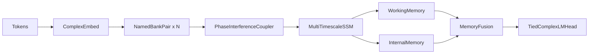

# V6: A Phase-First, Attention-Free-by-Default Language Model

Draft manuscript for the V6 line of `qllm2`.

Status: working Markdown-first paper draft, intended for later conversion into a LaTeX paper package.

## Abstract

We present V6, a phase-first language modeling architecture built around a simple question: can a complex-valued, phase-preserving, attention-free-by-default autoregressive model remain trainable and useful once it is equipped with explicit timescale structure and a controlled memory hierarchy?

V6 combines complex embeddings and phase-preserving primitives inherited from V5 with four main architectural changes: named banks (`SemanticBank` and `ContextBank`), a `PhaseInterferenceCoupler` that mixes bank outputs through learned phase rotations and content-dependent routing, a multi-timescale complex state-space backbone with explicit fast/medium/slow decay lanes, and an optional memory hierarchy with phase-coherence retrieval. The default and safest validated path in the current repository is still autoregressive language modeling with attention disabled. A shared backbone also exists for diffusion text and diffusion image modes, but those paths are presently architectural scaffolding rather than validated headline results.

Current evidence supports several narrow claims. First, V6 clearly learns without attention on TinyStories and is now training on WikiText-103. Second, memory capacity, especially working-memory capacity, is a major behavioral control knob: too much memory induces memorization, while reduced or zero memory yields more stable generation. Third, working memory matters much more than internal memory at the current scale. On full TinyStories, a 28.7M no-memory `small-matched` V6 run reaches validation perplexity 5.50 after five epochs with no observed repetition or restart fragmentation. A reduced-memory run with `WM=16` and `IM=32` reaches validation perplexity 2.23 after one epoch, but exhibits restart fragmentation that makes it unsuitable as the cleanest main quality result.

We frame this paper as a current evidence package for the autoregressive V6 design, not as proof of broad superiority over matched transformers or as validation of all planned V6 features. Long-context coherence, persistent and expert memory at scale, diffusion performance, and bank-specialization claims remain open questions and are marked explicitly as placeholders for future validation.

## 1. Introduction

The `qllm2` project has now gone through three distinct stages of the same research line:

- V4 introduced the main novelty: tokens in complex phase space, wave-style interference between processing banks, and a non-transformer O(n) direction.
- V5 corrected a core mathematical problem in V4: complex representations were repeatedly passed through real-valued nonlinear paths that destroyed phase information.
- V6 asks the next question: once the phase-preserving core is in place, can we build a stronger autoregressive architecture around explicit timescale structure and controlled memory, while keeping attention off by default?

This paper focuses on that third step.

The central V6 design choice is not just “use complex numbers.” V6 is organized around four stronger hypotheses:

1. Complex-valued modeling is only meaningful if phase is preserved all the way through the computation.
2. Separate named banks can provide different learned views of the same token stream, even if present evidence for their specialization is still weak.
3. A multi-timescale state-space model can provide a more structured recurrent backbone than a single-timescale diagonal recurrence.
4. Memory modules are not automatically beneficial; their capacity changes the memorization/generalization tradeoff and must be treated as a controlled experimental variable.

The current paper is intentionally conservative. It does not claim that V6 is already a finished long-context system, that diffusion is validated, or that complex-valued language models beat transformers broadly. What it does claim is narrower and testable: V6 has become a real autoregressive model family with concrete behavior, reproducible training runs, and experimentally visible tradeoffs that justify a dedicated paper.

### 1.1 Core contribution of this draft

The goal of this manuscript is to consolidate what V6 currently *does* and what V6 merely *contains in code*. In particular:

- autoregressive V6 is paper-ready enough for a serious draft
- diffusion support is implemented but not yet central evidence
- memory hierarchy is implemented, but only some parts are experimentally validated
- best perplexity and best generation quality currently come from different V6 configurations

That last point is especially important. A major theme of this draft is that lower perplexity is not automatically better behavior when explicit memory can learn shortcuts tied to data boundaries.

## 2. Relationship to Earlier Versions

### 2.1 V4 as the origin of the idea

V4 introduced the phase-space and wave-interference framing. It established the novelty of treating tokens as complex-valued states and language computation as interference between structured pathways. It also established the O(n) ambition. However, V4 mixed complex representations with real-valued nonlinear operations in ways that undermined the phase story.

### 2.2 V5 as the mathematical correction

V5 fixed the most serious inconsistency in V4 by making the signal path phase-preserving. The V5 paper centered on that correction and showed that mathematically cleaner complex-valued computation materially improved results. In that sense, V5 is the direct technical foundation of V6.

### 2.3 V6 as the systems-and-structure step

V6 keeps the V5 lesson that phase must be preserved, but it shifts the architectural story:

- from generic banks to named banks
- from algebraic fusion to explicit phase-interference coupling
- from a single recurrence story to explicit fast/medium/slow state lanes
- from no real memory hierarchy to a stack of working, internal, persistent, expert, and optional session memory
- from an autoregressive-only framing to a backbone designed for later modality reuse

The manuscript therefore treats V6 neither as “just V5 plus memory” nor as a clean-sheet replacement of V5. It is better viewed as V5’s phase-preserving foundation combined with V4’s original intuitions about interference and memory.

## 3. Related Work

This draft intentionally keeps related work lightweight because the present goal is to establish the V6 architecture and evidence package, not to finalize a conference-ready bibliography. The final LaTeX paper should expand this section and add formal citations throughout.

### 3.1 Transformers and attention-heavy language modeling

Modern language models are dominated by attention-based transformers and their efficiency variants. V6 is relevant to this literature mainly because it asks whether a useful language model can be trained with attention *disabled by default* while still preserving a flexible representation geometry and some form of explicit retrieval.

Placeholder references to add in the final paper:

- Transformer foundations
- efficient/local/sparse attention variants
- long-context transformer systems

### 3.2 State-space and recurrent alternatives

V6 sits closer to modern state-space and recurrence-centric architectures than to full attention models. Its backbone is a stacked complex selective SSM with parallel scan and explicit timescale partitioning. The final paper should cite S4, Mamba, Mamba-2, Griffin/Jamba-style hybrids, and related efficient sequence models.

Placeholder references to add in the final paper:

- S4
- Mamba
- Mamba-2
- recurrence-attention hybrids

### 3.3 Complex-valued neural computation

The strongest conceptual inheritance of V6 comes from complex-valued neural networks, especially work emphasizing unitary dynamics, complex nonlinearities, and phase-preserving computation. V5 established why that matters in this project; V6 assumes that lesson and builds a more structured architecture on top of it.

Placeholder references to add in the final paper:

- deep complex networks
- unitary/complex recurrent models
- `modReLU` and related phase-preserving nonlinearities

### 3.4 Memory-augmented modeling

V6 also belongs partly to the literature on memory-augmented models and retrieval systems, but with an important caveat: most of V6’s memory work is retrieval over learned or external slot stores using phase coherence, not token-token attention over a sequence cache. This part of the related-work section should be expanded once the empirical memory story settles.

Placeholder references to add in the final paper:

- memory-augmented neural networks
- associative memory systems
- retrieval-augmented generation
- external memory for personalization

### 3.5 Diffusion

Diffusion appears in V6 only as an implemented extension path on top of the shared backbone. It should not be treated as a central related-work anchor in the current draft beyond a brief mention and placeholder references.

## 4. Method

This section describes the *actual* V6 architecture implemented in code. The main evaluated path in this paper is autoregressive V6. Diffusion is discussed only briefly as a shared-backbone extension.

## 4.1 High-level architecture

The default autoregressive V6 path is:

More precisely, the implemented `PhaseFieldLM` in [v6/model.py](/home/gowrav/Development/qllm2/v6/model.py) applies:

1. `ComplexEmbed`
2. embedding normalization
3. `PhaseFieldBackbone`
4. complex LM-head projection and normalization
5. tied output logits via the real part of a complex inner product with the embedding table

The shared `PhaseFieldBackbone` in [v6/backbone.py](/home/gowrav/Development/qllm2/v6/backbone.py) contains most of the actual model:

- per-layer named bank pairs
- per-layer phase-interference couplers
- optional `PhaseAttention` ablations
- stacked multi-timescale `ComplexSSM`
- working and internal memory
- optional persistent and expert memory readers
- learned memory fusion

## 4.2 Phase-preserving representation and primitives

Like V5, V6 represents complex tensors as real/imaginary pairs of shape `[..., dim, 2]`. This is not a superficial implementation detail. The entire modeling claim depends on preserving phase information through the path instead of repeatedly converting the signal into phase-breaking real-valued operations.

Inherited from the V5-era complex core and reused in V6:

- complex linear maps
- complex normalization
- complex gated units
- complex multiplication for phase rotation
- magnitude extraction via `cabs`
- real part of complex inner products for retrieval and logits

The practical result is that V6 stays phase-preserving in the main signal path even when some control logic remains real-valued.

## 4.3 Named banks

Each V6 layer begins with a `NamedBankPair` defined in [v6/core/bank.py](/home/gowrav/Development/qllm2/v6/core/bank.py). The pair consists of:

- `SemanticBank`
- `ContextBank`

Both banks share the same internal macro-structure:

- `ComplexNorm`
- `ComplexGatedUnit`
- dropout

The distinction between “semantic” and “context” is currently architectural intent, not yet a fully demonstrated empirical decomposition. The code names and regularization encourage specialization, but the present draft does **not** claim that this specialization has been conclusively validated.

### 4.3.1 Diversity regularization

`NamedBankPair.compute_diversity_loss()` computes a margin-based penalty using complex cosine similarity:

`Re(a * conj(b)) / (|a| * |b|)`

This is one of the weaker parts of the current V6 evidence package. The implementation bug inherited from V5 was fixed, but `EXPERIMENTS_V6.md` shows that the diversity loss still tends to collapse early in training. Therefore, this paper treats diversity regularization as implemented methodology, not as a cleanly validated specialization mechanism.

## 4.4 PhaseInterferenceCoupler

The `PhaseInterferenceCoupler` in [v6/core/coupler.py](/home/gowrav/Development/qllm2/v6/core/coupler.py) is the main replacement for V5’s algebraic fusion story.

For each bank output, the coupler performs:

1. complex projection into a shared coupling space
2. learned unit-complex phase rotation
3. content-dependent real routing over bank magnitudes
4. weighted summation
5. output projection and normalization

At a high level:

`output = norm(proj(sum_i route_i * rotate(source_i, phase_i)))`

This is one of the clearest V6 architectural claims: the model no longer just blends bank outputs through a generic fusion block. Instead, it performs bank mixing through explicit phase rotations and routing.

Important caution: the routing network itself is real-valued (`Linear -> GELU -> Linear -> softmax`) over magnitude features. That is acceptable for the current paper, but the wording should remain “phase-preserving signal path with mixed control logic,” not “purely complex-valued end to end with no real control components.”

## 4.5 Multi-timescale complex SSM

The recurrent backbone in [v6/core/ssm.py](/home/gowrav/Development/qllm2/v6/core/ssm.py) is a stacked complex selective SSM with explicit timescale partitioning.

The state is divided into three bands:

| Lane | Fraction of `state_dim` | Decay range | Intended role |
| --- | --- | --- | --- |
| Fast | 40% | `0.9` to `0.99` | local syntax and recent tokens |
| Medium | 30% | `0.999` to `0.9999` | sentence and paragraph coherence |
| Slow | 30% | `0.99999` to `0.999999` | durable facts and long-lived context |

This is one of the most paper-worthy implementation details in V6. The architecture does not merely rely on learned recurrent dynamics to *discover* timescales. It starts with an explicit multi-timescale prior.

The core layer computes a complex selective recurrence:

`h[t] = A_t * h[t-1] + B_t * x[t]`

with:

- input-dependent timescale selection via `dt_proj`
- complex diagonal transitions
- complex skip connection `D`
- parallel scan for the recurrence

The associative scan operator is inherited from V5 and still matters computationally. However, the conceptual contribution in V6 is less about the scan itself and more about the explicit fast/medium/slow lane structure.

## 4.6 Memory hierarchy

The memory system is implemented in [v6/core/memory.py](/home/gowrav/Development/qllm2/v6/core/memory.py). It consists of several memory types with different lifetimes and training behavior.

### 4.6.1 Working memory

Working memory is a per-sequence differentiable scratchpad:

- runtime tensors, not persistent parameters
- learned write/read projections
- selective write gating
- circular write pointer
- slot freshness decay
- top-k sparse retrieval over slots

Retrieval is based on phase coherence:

`score(query, key) = Re(query * conj(key)) / (|query| * |key|)`

At the current scale, working memory is the most experimentally important memory type. The ablation evidence consistently shows that it matters much more than internal memory.

### 4.6.2 Internal memory

Internal memory is a set of trainable key/value slots stored as model parameters. It is intended to capture general language knowledge learned during training rather than per-sequence state.

Current evidence suggests that internal memory contributes little at the scales explored so far. The paper therefore includes it as an implemented component but does not treat it as a major validated source of gain.

### 4.6.3 Persistent, expert, and session memory

These mechanisms also exist in the code:

- `PersistentMemoryStore`: external per-user memory saved and loaded from disk
- `ExpertMemoryStore`: shared read-only memory
- `SessionMemoryBuffer`: between-turn memory buffer
- `MemoryAdaptation`: soft alignment from persistent memory back toward internal memory

These are important for the long-term V6 vision, but they are **not yet paper-ready evidence**. In particular, session memory currently appears more like planned infrastructure than a fully exercised training path. This draft therefore describes them briefly and pushes their evaluation into a dedicated placeholders section.

### 4.6.4 Memory fusion

When multiple memory sources are active, `MemoryFusion` dynamically combines them using learned complex projections and a real-valued gate over magnitude features. Separate fusion modules exist for two, three, and four memory sources.

This is a useful implementation detail for the Methods section because it clarifies that V6 is not hard-coded around exactly one memory source.

## 4.7 Optional attention

Despite the project shorthand “no attention,” the codebase still contains optional `PhaseAttention` in [v6/backbone.py](/home/gowrav/Development/qllm2/v6/backbone.py). This is used as an ablation or fallback path and is disabled by default in the main V6 direction.

Accordingly, the strongest accurate wording in this paper is:

- **attention-free by default**
- **autoregressive evidence centered on attention disabled**

not:

- “attention does not exist anywhere in V6”

## 4.8 Shared backbone and diffusion scaffold

The diffusion model in [v6/diffusion_model.py](/home/gowrav/Development/qllm2/v6/diffusion_model.py) reuses the same `PhaseFieldBackbone` and adds:

- complex timestep conditioning
- mode-specific encoder/decoder
- diffusion loss and sampling logic

This is architecturally interesting because it avoids rebuilding the core stack later. However, the current paper treats diffusion as **scaffold, not validated result**. The diffusion pathway is therefore mentioned here only to explain why it exists in the codebase and why it should not be overclaimed elsewhere in the manuscript.

## 5. Experimental Protocol

This section documents the current V6 evidence package. It is intentionally explicit about what is complete, what is in progress, and what is only planned.

## 5.1 Main evaluation stance

The current V6 paper should be read as an autoregressive evidence package, not a finalized benchmark study. The completed evidence consists mostly of:

- TinyStories smoke tests
- CPU validation runs
- 100K TinyStories ablations
- full TinyStories ablations
- an ongoing WikiText-103 run

The current draft does **not** present:

- a matched transformer benchmark suite
- formal long-context evaluation
- persistent/expert/session memory training at scale
- validated diffusion results

## 5.2 Datasets

### TinyStories

TinyStories is the main completed evaluation dataset so far. The training pipeline in [v6/train.py](/home/gowrav/Development/qllm2/v6/train.py) uses:

- Hugging Face `roneneldan/TinyStories`
- official train/validation splits
- GPT-2 tokenizer
- EOS-separated flattening into token streams
- mojibake repair
- token caching under `.cache/v6_tokens`

TinyStories is currently the strongest source of evidence because it includes the broadest set of completed V6 runs and ablations.

### WikiText-103

WikiText-103 is now part of the V6 training script and serves as a more realistic corpus beyond TinyStories. The current evidence here is preliminary:

- raw text lines are joined and tokenized in large chunks
- caching is supported
- current public evidence is an in-progress `small-matched` no-memory run

### PG-19

PG-19 support exists in the training code and is clearly part of the intended long-context validation story, but the present manuscript should treat it as a future experiment path rather than a completed result section.

## 5.3 Training setup

The training stack in [v6/train.py](/home/gowrav/Development/qllm2/v6/train.py) uses:

- `AdamW`
- separate decay / no-decay parameter groups
- `warmup_cosine` or cosine scheduling
- gradient clipping
- AMP with automatic preference for bf16 when available
- `GradScaler` only when fp16 requires it

Generation samples logged during training use stochastic decoding defaults:

- `top_k = 50`
- `top_p = 0.9`
- `repetition_penalty = 1.2`

These details matter because some of the qualitative story is based on logged generations, not only on perplexity.

## 5.4 Reporting philosophy

This paper explicitly separates:

- best perplexity
- best generation quality
- most stable configuration
- most promising but still provisional configuration

This is necessary because explicit memory can reduce perplexity while introducing new failure modes such as restart fragmentation.

## 6. Results

## 6.1 Smoke and CPU validation

The earliest V6 evidence showed that the model learns at all without attention and that the implementation is trainable end to end.

### Smoke test summary

| Run | Size | Device | Data | Best reported val PPL | Notes |
| --- | --- | --- | --- | --- | --- |
| `v6-smoke` | `tiny` | CPU | 100 samples | ~200 by epoch 2 | confirms learning and generation work |
| `v6-cpu-test` | `tiny` | CPU | 2000 samples | **42.18** at epoch 5 | clean early evidence that V6 learns without attention |

Key takeaway:

- V6 can learn in an attention-free configuration
- the model trains, backpropagates, saves, and generates correctly
- the architecture is worth scaling up

## 6.2 TinyStories 100K ablations

The 100K TinyStories tiny-model ablation is one of the clearest experimental sections in the current V6 evidence package.

| Run | Description | WM | IM | Attention | Params | Best Val PPL | tok/s |
| --- | --- | --- | --- | --- | --- | --- | --- |
| A | baseline | 16 | 32 | off | 7.30M | **8.84** | ~130k |
| B | no memory | 0 | 0 | off | 7.26M | 11.83 | ~141k |
| C | IM only | 0 | 32 | off | 7.28M | 11.77 | ~139k |
| D | WM only | 16 | 0 | off | 7.29M | **8.88** | ~135k |
| E | all memory + attention | 16 | 32 | last layer | 7.34M | **8.61** | ~113k |

### Main finding from the 100K ablations

Working memory dominates the observed memory benefit:

- `WM only` is nearly identical to `WM + IM`
- `IM only` is nearly identical to `no memory`

This is one of the strongest supported V6 claims and should likely be central to the Discussion section.

### Secondary finding

Optional attention improves PPL only slightly at this scale, while costing noticeable throughput. That supports the current decision to keep the default V6 path attention-free.

### Important caution

The diversity-loss story remains weak even here. The results do not justify strong claims that explicit diversity regularization has empirically solved bank specialization.

## 6.3 Full TinyStories: no-memory baseline

The no-memory `small-matched` run on full TinyStories is currently the safest main result for the paper because it is both strong and behaviorally clean.

### One-epoch baseline

| Config | Params | WM | IM | Epochs | Best Val PPL | Notes |
| --- | --- | --- | --- | --- | --- | --- |
| `small-matched` | 29.1M | 0 | 0 | 1 | **7.36** | stable, no memorization |

### Five-epoch extension

| Epoch | Train PPL | Val PPL |
| --- | --- | --- |
| 1 | 9.93 | 6.63 |
| 2 | 6.54 | 6.01 |
| 3 | 6.16 | 5.76 |
| 4 | 5.97 | 5.62 |
| 5 | 5.85 | **5.50** |

This run is important because:

- validation keeps improving
- train/val gap remains small
- no repetition or restart fragmentation is reported
- generation quality is cleaner than the lower-PPL reduced-memory run

### Interpretation

The no-memory V6 baseline establishes that the core architecture already does meaningful work even without explicit memory assistance. That matters because it means the V6 story is not simply “a memory system made the model good.”

## 6.4 Full TinyStories: reduced memory

The reduced-memory full-data run with `WM=16` and `IM=32` is arguably the most interesting single result in the current evidence package.

| Config | Params | WM | IM | Epochs | Best Val PPL | Main caveat |
| --- | --- | --- | --- | --- | --- | --- |
| `small-matched` | 29.2M | 16 | 32 | 1 | **2.23** | restart fragmentation |

This run is impressive because it substantially improves perplexity over the no-memory baseline. However, it also introduces a new failure mode: mid-sequence restart fragmentation, often visible as repeated re-entry into TinyStories-style openings such as “Once upon a time...”.

### Why this matters

This configuration should be presented as:

- **promising**
- **currently best PPL**
- **not yet the safest main quality result**

The paper should not present this run as a clean final headline until multi-epoch stability and fragmentation behavior are better understood.

## 6.5 Full TinyStories: overprovisioned memory and memorization

One of the strongest negative results in V6 is also one of the most valuable:

- large working/internal memory can drive memorization even when the model architecture itself is not obviously broken

The original `small-matched` runs with large memory capacity showed:

- PPL collapsing toward ~1.2
- catastrophic repetition
- strong evidence of memorization rather than healthy generalization

This leads to one of the paper’s most important takeaways:

> Memory capacity, especially working-memory capacity, behaves as a memorization knob.

That is a much stronger and more defensible statement than claiming “memory helps” in the abstract.

## 6.6 Full TinyStories: tiny model

A 7.3M `tiny` model with `WM=16` and `IM=32` on the full dataset reaches:

- validation PPL **4.64** after one epoch

This run is useful mainly as a capacity-controlled sanity check:

- it does not memorize like the larger overprovisioned memory model
- it confirms that scaling the data helps V6 materially
- it shows that some unstable-looking behavior can be reduced simply by lowering effective memorization capacity

## 6.7 Preliminary WikiText-103 evidence

The ongoing WikiText-103 run is the first clear sign that V6 is moving beyond TinyStories-only validation.

Current completed epochs from the active `small-matched` run:

| Epoch | Train PPL | Val PPL |
| --- | --- | --- |
| 1 | 247.45 | 121.94 |
| 2 | 106.70 | 82.86 |
| 3 | 83.45 | 70.64 |
| 4 | 74.32 | **64.91** |

Run details:

- model: `small-matched`
- memory: no working/internal memory in the current public run
- sequence length: 512
- hardware: RTX 4090
- throughput: ~46K tokens/s
- status: run still in progress

### Qualitative signal

The run is not yet mature enough for strong cross-domain claims, but generation already shows Wikipedia-like structure:

> The history of the event.
>
> `=== The Summer Olympics ===`
>
> During the Olympics, the men's team competed in the event...

That is not factual accuracy evidence, but it is meaningful domain-shape evidence.

### Current status of this section

This subsection should remain explicitly labeled **preliminary** until:

- the run progresses substantially further
- final held-out metrics stabilize
- comparison baselines are available

## 6.8 Main results summary

| Result type | Best current evidence | Why it matters |
| --- | --- | --- |
| Cleanest stable main result | `small-matched`, no memory, TinyStories full, val PPL **5.50** at epoch 5 | strongest safe headline for current paper |
| Best current PPL | `small-matched`, `WM=16`, `IM=32`, TinyStories full, val PPL **2.23** at epoch 1 | highly promising, but behaviorally provisional |
| Best memory insight | `WM only` ~= `WM + IM`; `IM only` ~= `no memory` | working memory dominates current gains |
| Strongest negative result | large memory leads to memorization and repetition | memory capacity is a control knob, not a free win |
| Cross-domain progress | WikiText-103 val PPL **64.91** at epoch 4 | V6 is no longer TinyStories-only |

## 7. Discussion

The current V6 evidence suggests that the most important story is not “complex numbers” in isolation. V5 already established that mathematical consistency matters. What V6 adds is a more structured view of *where behavior comes from*:

- the phase-preserving core provides the baseline competence
- the multi-timescale SSM provides a stronger recurrent prior
- the memory stack changes behavior dramatically, sometimes for better and sometimes for worse

## 7.1 Memory capacity is the main behavioral knob

Across the completed ablations, working-memory capacity controls the largest behavior shift:

- too much memory: memorization and degeneration
- moderate memory: lower PPL but new restart-fragmentation behavior
- no memory: worse PPL, but cleaner generation

This is a useful and publishable insight even before the system is “finished.” It turns memory from a vague architectural extra into an experimentally manipulable variable.

## 7.2 Best perplexity is not best generation

The reduced-memory full-data run reaches the best current V6 PPL, yet the no-memory run currently produces the cleanest, most stable generations. This means the manuscript should explicitly resist optimizing the narrative around a single number.

This is especially important for any future V6 paper because explicit memory can exploit data-boundary shortcuts and reduce perplexity without actually improving generation quality.

## 7.3 Working memory is useful; internal memory is still unclear

At current scale:

- working memory matters a lot
- internal memory does not show a strong independent effect

That does not mean internal memory is useless. It means the current experiments do not yet justify a strong claim for it.

## 7.4 Attention is not central to the current gains

At least in the 100K tiny-model setting, optional attention yields only a marginal PPL gain at noticeable throughput cost. That does not prove attention is never helpful, but it does support the decision to keep the current V6 story centered on the attention-free default path.

## 7.5 WikiText-103 is strategically important

TinyStories is useful because it exposes memorization behavior and makes iteration fast. But a V6 paper that stayed there permanently would be too narrow. The ongoing WikiText-103 run matters because it begins to test whether the architecture generalizes to a different corpus style and different structural demands.

## 8. Limitations

This paper should be unusually explicit about what V6 does *not* yet establish.

### 8.1 No transformer-level benchmark claim

There is no finalized apples-to-apples transformer benchmark suite at the same parameter scale and training budget in the current V6 evidence package.

### 8.2 Long-context coherence is still a hypothesis

The architecture was designed with long-context ambitions in mind, but the current paper does not yet contain formal long-context evaluation.

### 8.3 Bank specialization is not yet convincingly demonstrated

The banks are named and regularized, but the present evidence does not justify strong claims that one bank has become semantic while the other has become contextual in a clean empirical sense.

### 8.4 Persistent, expert, and session memory are not validated at scale

These mechanisms exist in code and are part of the broader V6 vision. However, they are not yet validated enough to be presented as core achieved results.

### 8.5 Diffusion is scaffold, not evidence

The shared diffusion path is real and implemented, but it is not yet a tested headline capability. The manuscript should keep diffusion in background/appendix/future-work roles only.

### 8.6 Some cross-version comparison claims still need cleanup

`EXPERIMENTS_V6.md` contains multiple comparison narratives involving V5 and external runs that are not yet clean enough to serve as the central comparison story in a paper. For now, the paper should rely on:

- direct V6 evidence
- restrained predecessor context
- narrow, supportable cross-version statements only

## 9. Placeholders for Future Validation

This section is intentionally explicit. These are not missing edits; they are deliberate placeholders for the next experimental phase.

## 9.1 Placeholder: long-context evaluation

Pending experiments:

- 500+ token generation
- entity persistence across long spans
- setting consistency over long narratives
- memory-enabled vs no-memory long-context comparison

Suggested future table:

| Config | Context length | Entity tracking | Setting consistency | Notes |
| --- | --- | --- | --- | --- |
| Placeholder | Placeholder | Placeholder | Placeholder | Placeholder |

## 9.2 Placeholder: multi-epoch reduced-memory stability

The `WM=16`, `IM=32` configuration is currently promising but provisional.

Pending experiments:

- 5-10 epoch continuation
- restart fragmentation tracking over time
- comparison against no-memory baseline after matched training budget

## 9.3 Placeholder: middle-ground memory capacity

The current evidence suggests there may be a useful middle regime between:

- `WM=16`, `IM=32`
- `WM=64`, `IM=128`

Pending experiments:

- `WM=32`, `IM=64`
- `WM=24`, `IM=32`
- `WM only` at larger scales

## 9.4 Placeholder: persistent and expert memory at scale

The code already supports:

- persistent memory
- expert memory
- memory adaptation

Pending experiments:

- training or evaluation with real persistent memory
- domain-specific expert memory
- user adaptation without fine-tuning

## 9.5 Placeholder: final WikiText-103 section

The current WikiText-103 section should expand later to include:

- more completed epochs
- stable held-out numbers
- comparison baselines
- more careful qualitative analysis

## 9.6 Placeholder: diffusion appendix

The eventual appendix can include:

- shared backbone rationale
- diffusion training path summary
- text diffusion notes
- image diffusion notes
- why diffusion was scaffolded early to avoid duplicated infrastructure

At present, none of this should be elevated to a headline V6 experimental claim.

## 10. Reproducibility Checklist

The final LaTeX version should preserve the V5 paper’s reproducibility culture.

For each result row, report:

- exact config
- exact memory settings
- seed
- hardware
- precision mode
- compile settings
- dataset split and token counts
- decoding settings for qualitative samples
- commit hash if available from run metadata

## 11. Validated Claims vs Placeholder Claims

| Claim | Status | How to phrase it now |
| --- | --- | --- |
| V6 has an attention-free default autoregressive path | validated | safe main claim |
| V6 learns on TinyStories | validated | safe main claim |
| working memory matters more than internal memory at current scale | validated | safe discussion claim |
| memory capacity controls memorization/generalization tradeoff | validated | safe main discussion claim |
| V6 now trains on WikiText-103 | validated but preliminary | safe, with caveat |
| V6 improves long-context coherence | placeholder | future work only |
| persistent memory enables personalization without fine-tuning | placeholder | future work only |
| expert memory works at scale | placeholder | future work only |
| diffusion is a validated V6 capability | not supported yet | do not claim |
| bank names correspond to clean semantic/context specialization | weakly supported at best | phrase cautiously |
| V6 broadly beats transformers | not established | do not claim |

## 12. Conclusion

V6 is now substantial enough to deserve its own paper. The current autoregressive evidence supports a real architectural story:

- phase preservation still matters
- named banks and phase-interference coupling produce a distinct V6 stack
- multi-timescale SSMs provide a stronger recurrent backbone
- working memory changes behavior more than internal memory
- memory capacity must be tuned carefully because it can induce memorization

The most honest current headline is not “V6 is finished” and not “V6 beats everything.” It is this:

> V6 has become a real, improving, attention-free-by-default autoregressive model family with experimentally visible strengths, weaknesses, and control knobs. That is enough to justify a dedicated manuscript now, while still marking major open questions explicitly.

## Appendix A. Suggested Next Tables For The LaTeX Version

- final TinyStories result table
- 100K ablation table
- full-data memory-capacity table
- WikiText-103 progress table
- validated-claims table
- placeholder experiments table

## Appendix B. Suggested Citation Expansion

Add formal references in the LaTeX version for:

- transformer foundations
- efficient attention
- S4 / Mamba / Mamba-2
- complex-valued neural networks
- `modReLU`
- memory-augmented neural networks
- retrieval systems
- diffusion models

## Appendix C. Notes For Later Conversion To LaTeX

When converting this Markdown draft into a paper package:

- keep the abstract conservative
- keep diffusion out of the title
- keep the main paper centered on autoregressive V6
- move speculative system claims into limitations or appendix
- preserve the distinction between best PPL and best generation quality
