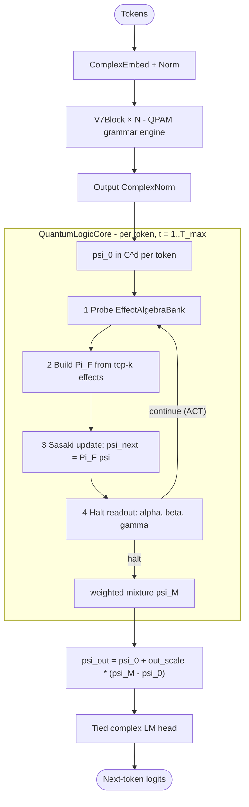

# V8 — Constrained Latent Memory and Adaptive Compute over Phase-Associative Memory

**Gowrav Vishwakarma** — Independent Researcher, India
**Christopher J. Agostino** — NPC Worldwide, Bloomington, Indiana 47403, USA

**Repository:** [github.com/gowrav-vishwakarma/qllm2](https://github.com/gowrav-vishwakarma/qllm2)

April 2026

---

## Abstract

We extend Phase-Associative Memory (PAM) — the complex-valued, attention-free
matrix-state recurrence introduced in v6 — with an explicit **Quantum-Logic Core
(QLC)** that decomposes the language model into three computational machines: a
*grammar engine* (the unmodified PAM/QPAM backbone), a *constrained latent
memory* consisting of a low-rank orthonormal projector and a learnable bank of
rank-1 effects, and an *adaptive reasoning loop* that iterates a Sasaki-style
update on the per-token state and halts when it has accumulated enough
evidence. The architecture is *inspired* by operational quantum logic — Sasaki
projections, effect algebras, orthocomplement readouts, ACT-style halting — but
the contribution we test for in this paper is the *classical inductive bias*:
explicit rank-bounded subspace memory plus per-token adaptive computation.

After two reframing rounds (v8.1 audit and v8.2 unfreeze) we treat the
operational quantum-logic reading as an **ablation hypothesis** rather than a
default claim. The paper documents the architecture, the math, the discriminator
suite that earns or kills each quantum-flavoured claim, and the current
empirical state of the medium 104.4M-parameter run on WikiText-103.

**Key code paths.**
- [`v8/model.py`](model.py) — `V8LM` glues the V7/QPAM backbone, QLC, and tied LM head.
- [`v8/qlc/projector.py`](qlc/projector.py) — `SasakiProjectionMemory`.
- [`v8/qlc/effect_bank.py`](qlc/effect_bank.py) — `EffectAlgebraBank`.
- [`v8/qlc/halt.py`](qlc/halt.py) — `OrthoHalt`, `DeltaHalt`, `EntropyHalt`, `MLPHalt`.
- [`v8/qlc/reason_loop.py`](qlc/reason_loop.py) — `QuantumLogicCore`.

Companion documents: the audit ([`v8/AUDIT_V8.md`](AUDIT_V8.md)), the
classical-rethink plan
([`.cursor/plans/v8_classical_rethink_44e4a93c.plan.md`](../.cursor/plans/v8_classical_rethink_44e4a93c.plan.md)),
the experiments log
([`v8/EXPERIMENTS_V8.md`](EXPERIMENTS_V8.md)), and the long-form README
([`v8/README_V8.md`](README_V8.md)).

---

## 1. Where v6 left off, and what v8 is for

V6 (PAM) showed that a complex-valued matrix-state recurrence
$S_t = \gamma_t S_{t-1} + V'_t \otimes K_t^*$ with conjugate retrieval
$Y_t = S_t \tilde{Q}_t$ can compete with a matched transformer at ~100M
parameters on WikiText-103 (29.95 PPL vs 27.08 PPL), while doing
$O(1)$-per-token inference with no KV cache. The architectural and theoretical
case is laid out in [`v6/paper/paper.md`](../v6/paper/paper.md) and in our
PRL-style writeup
[`v6/paper/aps_main.tex`](../v6/paper/aps_main.tex):

- The state is a **per-head complex matrix** $S_t \in \mathbb{C}^{d \times d}$,
  giving $O(d^2)$ associative capacity per head.
- Retrieval is governed by **phase alignment** between query and stored key
  through the conjugate inner product $K^* \cdot Q$, providing a geometric
  selectivity mechanism that real-valued matrix-state models lack.
- The architecture is consistent with the operational-quantum-logic position
  that *contextual* observables (and language-model semantics is observably
  contextual; see the Bell-violation evidence cited in
  [`v6/paper/aps_main.tex`](../v6/paper/aps_main.tex)) live naturally in a
  complex Hilbert space.

What v6 did **not** address:

1. **Memory is still smeared across the backbone weights.** The matrix state
   is large but anonymous; you cannot point at "where Marie Curie lives" in
   $S_t$.
2. **Compute is fixed-depth.** The model spends the same amount of work on
   "the cat sat on the …" as on "according to the 1923 census the population
   of …". Real reasoning is variable depth.
3. **There is no native uncertainty signal.** "I'm not sure" can only be
   read out from the next-token entropy, not from the model's internal
   algebra.

V8 keeps the v6 backbone unchanged (the QPAM stack is reused verbatim — see
`V8LM.__init__` in [`v8/model.py`](model.py) lines 65–70) and stacks a new
module — the *Quantum-Logic Core* — on top of it. The QLC is built around
three ideas:

- **Explicit, addressable memory** (the `EffectAlgebraBank`, §3.2).
- **Capacity-bounded working state** (the `SasakiProjectionMemory`, §3.1).
- **Per-token adaptive computation** with an algebraic halt readout (the
  `OrthoHalt` head and the ACT-style loop, §§3.3–3.5).

We deliberately *do not* claim quantum advantage. The components are
quantum-inspired and use complex-valued algebra, but the working hypothesis is
that the gains, if any, come from the classical inductive biases (low-rank
constraint, explicit memory, adaptive halt). The discriminator suite (§5)
exists precisely to falsify the stronger reading.

---

## 2. Architecture overview

The QLC sits **between** the backbone and the LM head. When
`QLCConfig.enabled = False` the model collapses to a plain V7LM with the same
backbone — this is the "V8-A passthrough" sanity row.

Two facts about this placement that the §6 honesty discussion will keep
revisiting:

- The QLC operates on each **token position independently**. The backbone has
  *already finished* processing the sequence by the time the QLC runs. The
  loop is therefore "per-token adaptive refinement", not cross-token reasoning
  in the chain-of-thought sense (`reason_loop.py` lines 22–26, 241–243).
- The QLC contribution is gated by a small (init `0.05`, learnable) residual
  scale `out_scale`, so the loop adds at most a fraction of its raw output to
  the backbone state (`reason_loop.py` lines 196–205, 363–365).

---

## 3. The Quantum-Logic Core, component by component

### 3.1 Constrained latent memory: `SasakiProjectionMemory`

The working memory is a **rank-$r$ orthonormal subspace**
$\Pi = U U^\dagger$ over the complex $d$-dimensional state, with
$U \in \mathbb{C}^{d \times r}$ and $r \ll d$. Two operations matter:

- **Sasaki projection** (the canonical update): given a state $\psi$ and a
  fresh basis $U$ produced from selected effects (§3.2), the loop applies
  $\psi_{\text{next}} = \Pi \psi = U (U^\dagger \psi)$. This is the
  measurement-consistent state revision rule from quantum logic.
  See `SasakiProjectionMemory.sasaki_apply` in
  [`v8/qlc/projector.py`](qlc/projector.py) lines 316–371.
- **Streaming write** (`streaming_step`, lines 215–276): orthogonalize a new
  key against the current basis, normalize, and circularly write it into a
  slot. The complement step
  $k_\perp = k - U(U^\dagger k)$ enforces orthonormality without
  materializing the $d \times d$ projector. Cost is $O(dr)$ per write.

Two design choices in the projector are dictated by the discriminator suite:

1. A **`use_complex` flag** (lines 158–174) that zeros the imaginary channel
   on the way into and out of the memory, running the same code path in
   pure-real mode. This is the §G.2 real-vs-complex ablation: if the model
   matches in $\mathbb{R}^d$, then phase is not the source of any win.
2. A **true ordering test** (`sasaki_apply` with `prev_state` supplied,
   lines 347–366):
   $$y_{\text{sym}} = \tfrac{1}{2}\bigl(\Pi_{\text{curr}} \Pi_{\text{prev}} \psi + \Pi_{\text{prev}} \Pi_{\text{curr}} \psi\bigr)$$
   compared against the sequential composition
   $\Pi_{\text{curr}} \Pi_{\text{prev}} \psi$ that the default loop produces.
   This is the genuine non-commutativity check: if the symmetrized form
   significantly hurts perplexity, *order matters* and the loop is
   exploiting the quantale-style algebra.

Periodic re-QR (`_reorthonormalize`, lines 430–443) is available as a safety
net against numerical drift on long inference scans.

### 3.2 Explicit fact memory: `EffectAlgebraBank`

The bank stores $M$ learnable rank-1 *effects*
$$E_m = \sigma(s_m) \cdot u_m u_m^\dagger, \qquad u_m \in \mathbb{C}^d, \ \|u_m\| = 1,$$
with each effect satisfying $0 \le E_m \le I$ automatically because
$\sigma(s_m) \in [0, 1]$. This is an honest *effect algebra* in the
Foulis–Bennett sense: the partial sum
$e \oplus e' = e + e'$ is well defined whenever $e + e' \le I$. We do **not**
constrain the rows to be orthogonal, because the bank is a memory and we
want overlapping rows to model correlated facts. See
[`v8/qlc/effect_bank.py`](qlc/effect_bank.py) lines 1–50.

Each effect carries an associated **value vector** $w_m \in \mathbb{C}^d$
(lines 106–108) so retrieval through the projector returns content rather
than just the projected query.

The bank exposes three operations:

- `probe(psi)` — returns scores
  $\langle \psi | E_m | \psi \rangle = \sigma(s_m) \cdot |u_m^\dagger \psi|^2$
  for all $m$.
- `select_top_k(psi, k)` — picks the top-$k$ effects, runs QR on the selected
  $u$ vectors to produce an orthonormal basis $U \in \mathbb{C}^{d \times r}$
  with $r = k$, and returns the aligned values $V$. This is what feeds
  `SasakiProjectionMemory.build_from_basis` each iteration of the loop.
- `infonce_loss(psi_pos, psi_neg, gold)` — contrastive auxiliary used in
  Stage B / the v8.2 e2e presets to push the bank toward routing
  entity-cloze positives to dedicated effects rather than learning the
  bank as just-another-MLP through the LM cross-entropy gradient.

Effect gates `s_m` are initialized at $-2$ (sigmoid $\approx 0.12$) so the
bank starts mostly silent and the LM signal must "wake up" useful effects
during training (lines 110–113).

### 3.3 Algebraic halt: `OrthoHalt` and the $(\alpha, \beta, \gamma)$ readout

After each Sasaki update, the loop reads three numbers from the new state
against a learned per-head target effect. With the **unsharp-target**
parametrization
$E_{\text{target}} = \sigma(g) \cdot u u^\dagger$ (the canonical mode in
the v8.2 e2e presets), the readout is

$$
\alpha = \sigma(g)\,|u^\dagger \psi|^2, \qquad
\gamma = \bigl(1 - \sigma(g)\bigr)\,|u^\dagger \psi|^2, \qquad
\beta = \|\psi\|^2 - |u^\dagger \psi|^2,
$$

so $\alpha + \beta + \gamma = \|\psi\|^2$ and **each of the three masses
carries signal**. Intuitively:

- $\alpha$ is "this matches what I think the answer is" (target subspace mass
  routed through the gate),
- $\beta$ is "this clearly *does not* match" (orthogonal-complement mass),
- $\gamma$ is "I'm not sure yet" (gate deficit on the matched mass).

A 3-way classification head over the triple maps $(\alpha, \beta, \gamma)$
to logits over (halt-yes, halt-no, continue). The head is initialized
**continue-biased** (`weight = I`, `bias = [0, 0, 2]`) so the loop runs all
$T_{\max}$ iterations from step 0 and gradient flows through every step
([`v8/qlc/halt.py`](qlc/halt.py) lines 130–133, mirrored in `_init_weights`
in [`v8/model.py`](model.py) lines 138–148).

#### Why the $\gamma$ readout was rebuilt in v8.2

The legacy *sharp-projector* mode (`unsharp_target=False`) sets
$E_{\text{target}} = u u^\dagger$ and recovers
$\alpha = |u^\dagger \psi|^2$, $\beta = \|\psi\|^2 - \alpha$,
$\gamma = (1 - \alpha - \beta)_+$. Combined with the renormalization
$\|\psi\|^2 = 1$ in `reason_loop.py` (lines 319–322), the Pythagorean
identity on a Hilbert space forces $\alpha + \beta = 1$ exactly, so
**$\gamma \equiv 0$ by construction in both $\mathbb{R}^d$ and $\mathbb{C}^d$**.
The audit ([`v8/AUDIT_V8.md`](AUDIT_V8.md) §1) traces this to the sharp
projector identity $P^2 = P$; complex weights do not break it. The
unsharp-target fix is the structural rewrite that lets $\gamma$ have any
meaning at all.

#### Why a `target_alignment_weight` auxiliary was needed

Even after switching to unsharp targets, the first end-to-end medium run
showed `alpha = 0.001`, `gamma = 0.001` for 1,200 steps. The audit (§6) shows
why: with $u(\psi)$ initialized random vs $\psi$ and dim $d = 384$,
$|u^\dagger \psi|^2 \approx 1/d \approx 0.0026$, so any redistribution of
that mass between $\alpha$ and $\gamma$ stays at noise. Nothing in the loss
was rewarding $u(\psi)$ aligning with $\psi$.

The v8.2 fix adds an auxiliary
$$\mathcal{L}_{\text{align}} = \lambda_{\text{align}} \cdot \bigl(1 - \overline{|u^\dagger \psi|^2}\bigr)_+$$
to the LM loss (`V8LM.forward` in [`v8/model.py`](model.py) lines 304–307;
the signal comes from `reason_loop.py` lines 261–268, 268, 349, 372). With
$\lambda_{\text{align}} = 0.05$ and the continue-biased halt init,
the current medium run reaches `align ≈ 0.99` within 800 steps and the
$(\alpha, \beta, \gamma)$ triple takes coherent values
($\alpha \approx 0.81$, $\beta \approx 0.00$,
$\gamma \approx 0.18$ — the structural $1 - \sigma(1.5)$ gate deficit) at
step 2,500
([`logs/v8/e2e_medium_reasoning_wikitext103_20260424_172759_ab342a1/v8_e2e_medium_reasoning_wikitext103.log`](../logs/v8/e2e_medium_reasoning_wikitext103_20260424_172759_ab342a1/v8_e2e_medium_reasoning_wikitext103.log)).

### 3.4 The halt-head zoo

Three halt heads share the `OrthoHalt` interface and can be swapped via
`QLCConfig.halt_mode` (`reason_loop.py` lines 168–189):

| Head           | Signal                                   | Purpose                                             |
|----------------|------------------------------------------|-----------------------------------------------------|
| `OrthoHalt`    | $(\alpha, \beta, \gamma)$ triple         | Algebraic, the canonical quantum-inspired readout   |
| `MLPHalt`      | Plain MLP over real-2$d$ projection      | Ablation: never sees algebra                        |
| `DeltaHalt`    | $\|\psi_t - \psi_{t-1}\|^2$              | Empirical: halt when the iteration plateaus        |
| `EntropyHalt`  | Surrogate next-token entropy delta       | Empirical: halt when predictive entropy stops dropping |

The empirical halts (`DeltaHalt`, `EntropyHalt`) are §G.6 of the rethink
plan: cheap, task-aligned baselines that let us measure whether the
algebraic readout actually contributes any signal beyond "the loop did
something useful this step".

### 3.5 ACT-style pondering

The loop wraps each halt head in the Adaptive-Computation-Time (ACT)
formulation of Graves (2016) with a `halt_threshold = 0.99` cumulative
mass cap (`halt.py` lines 403–449). At each iteration $t$:

- the head emits $p_{\text{halt}}^{(t)} \in [0, 1]$;
- the loop tracks per-(batch, head) cumulative halt mass and a remainder;
- on the halting step, the *remainder* is attributed to that iteration; on
  every other step the iteration's weight is $p_{\text{halt}}^{(t)}$;
- the ponder cost
  $\text{cost} = \sum_t p_{\text{halt}}^{(t)} \cdot (\text{not-halted})$
  is returned alongside the pondered state, and
  $\lambda_{\text{ponder}} \cdot \text{cost}$ is added to the LM loss
  (`reason_loop.py` lines 245–246, 332–335; `V8LM.forward` line 300).

The pondered state is a **soft mixture** of the per-iteration
$\psi_{\text{next}}$ values, so gradients flow back through every iteration
the loop visited. After per-head merging via softmax-mixed weights
(`head_mix`, lines 359–361) the result is combined with the input through
the residual scale:

$$\psi_{\text{out}} = \psi_0 + \texttt{out\_scale} \cdot (\psi_{\text{merged}} - \psi_0).$$

`out_scale` is initialized to 0.05 and learnable by default (`reason_loop.py`
lines 196–205). Its trajectory is a useful interpretive signal: the open
medium-run log shows it slowly growing from 0.05 to 0.075 over the first
2,500 steps, suggesting the optimizer is asking for *more* QLC contribution,
not less.

### 3.6 Runtime schedule

The trainer ([`v8/train.py`](train.py)) supports a `--qlc_schedule` ramp
that linearly increases `t_max` (typically $2 \to 3 \to 4$) and
`ponder_lambda` ($0 \to 0.002 \to 0.005$) across three phases of training
(lines 273–342, 419–442). The schedule mutates only `model.qlc.t_max`,
`model.qlc_cfg.ponder_lambda`, and (optionally) `model.qlc.bank_temperature`
based on `global_step` — every other parameter stays under optimizer
control. The intent is to give the model a soft warmup on the loop's depth
budget so the bank and projector can find useful structure before the
ponder cost starts pruning iterations.

---

## 4. Auxiliary objectives

### 4.1 Target alignment (v8.2)

Added to break the $1/d$ noise floor on $\alpha$ and $\gamma$:
$\mathcal{L}_{\text{align}} = \lambda_{\text{align}} \cdot (1 - \overline{|u^\dagger \psi|^2})_+$
with $\lambda_{\text{align}} = 0.05$ in the canonical e2e presets. See §3.3
for the full diagnosis.

### 4.2 InfoNCE entity cloze (v8.2)

The bank's `infonce_loss` (`effect_bank.py` lines 32–35, plus the loader and
training step in `v8/train.py` lines 385–415, 1093–1109) trains the bank as
an actual fact-routing module instead of a generic parameter pile. We
construct a synthetic *entity-cloze* dataset (64 entities, 4,096 examples,
sequence length 32) and at every $K$-th LM step we score the unmasked vs
masked context against the bank's effects, asking the bank to map both to
the same effect index. The auxiliary is weighted at 0.05 in the e2e presets
and the InfoNCE loss visibly drops from 2.20 to 0.10 over the first 2,500
steps in the open run.

### 4.3 Ponder cost

$\lambda_{\text{ponder}} \cdot \text{cost}$, with $\lambda_{\text{ponder}}$
ramped 0 → 0.002 → 0.005 by the schedule. Without this term the model is
free to always run all $T_{\max}$ iterations; with it, the model learns to
think *just enough*.

---

## 5. The discriminator suite

The audit identified eight ways the original code either *over-claimed* or
*under-tested* the quantum-logic story. The classical-rethink plan
([`.cursor/plans/v8_classical_rethink_44e4a93c.plan.md`](../.cursor/plans/v8_classical_rethink_44e4a93c.plan.md)
§G) collapses these into a six-row discriminator suite that runs on
TinyStories or ~1 % of WikiText-103 and pre-decides whether the
quantum-flavoured claims have earned the A100 spend. Every row has a
preset in [`v8/config.py`](config.py) and is supported by code that
already exists today.

| #  | Preset / flag                              | What it tests                                         | Quantum claim if it survives                |
|----|--------------------------------------------|-------------------------------------------------------|---------------------------------------------|
| 1  | `equal_flop_passthrough`                   | Train V7 backbone for 12× more steps, no QLC          | Distinguishes "QLC helps" from "more compute helps" |
| 2  | `use_complex=False`                        | Real-only projector and loop                          | If complex still wins, **phase matters**    |
| 3  | Rank sweep $r \in \{1,2,4,8,16\}$          | Where the rank constraint stops paying                | Rules out "$r=1$ modulator" interpretation  |
| 4  | `out_scale ∈ {0.0, 0.01, 0.1, 0.5, 1.0}`   | Residual-strength sweep                               | Rules out "QLC is a regularizer"            |
| 5  | `equal_param_mlp`                          | Replace QLC with same-FLOPs MLP                       | If QLC wins, the *primitive* matters        |
| 6  | `halt_mode ∈ {ortho, mlp, delta, entropy}` | Algebraic vs empirical halting                        | If `ortho` wins, the algebraic readout matters |
| 7  | `quantale_off=True, quantale_order_test=True` | True symmetric-vs-sequential ordering test          | If sequential wins, **order matters**       |
| 8  | `unsharp_target=True` + `target_alignment` | Already on by default in e2e_*_reasoning              | Required for any meaningful $\gamma$        |

Rows 1, 4, 5 are the cheapest "is QLC even pulling its weight?" checks; rows
2, 6, 7 are the ones that earn the operational quantum-logic framing if
they pass. Rows 3 and 8 are necessary infrastructure.

---

## 6. Honest framing

We emphasize three places where the natural "this is a quantum reasoning
model" reading of the architecture is **wrong** or **not yet supported by
evidence**, because pretending otherwise would re-create the v8.0 problem
that the audit caught.

1. **The loop is per-token, not multi-step reasoning.** The QLC reshapes
   the backbone hidden sequence to `[B*T, d, 2]` and runs the inner loop on
   each position independently (`reason_loop.py` lines 22–26, 241–243). The
   cross-token state lives entirely in the QPAM backbone, which has finished
   before QLC starts. The honest description is "per-token adaptive
   refinement". A future v8.x might interleave the loop with the backbone
   blocks (Universal-Transformer / latent-recurrence pattern) to support the
   stronger claim; today's code cannot.

2. **The original $\gamma$ readout was structurally pinned to zero.** The
   sharp-projector identity $\alpha + \beta = \|\psi\|^2$ holds in both
   $\mathbb{R}$ and $\mathbb{C}$ (see §3.3 and [`AUDIT_V8.md`](AUDIT_V8.md)
   §1). The v8.2 unsharp-target rewrite gives $\gamma$ a non-degenerate
   meaning, but its current empirical value at training time
   (≈0.18, equal to $1 - \sigma(1.5)$) is dominated by the **gate
   parameter** rather than by any genuine non-commutativity signal in the
   data. The "$\gamma$ measures classical-logic failure" reading is only
   earned if (a) the gate $g$ moves substantially away from its init and
   (b) row 7 of the discriminator suite (sequential vs symmetric Sasaki)
   shows a measurable LM-loss difference.

3. **The smoke-stage gains are not cleanly attributable.** The TinyStories
   smoke result (passthrough 178.95 PPL, QLC r=4 T=2 173.40 PPL) is a 3 %
   PPL improvement at a 12× wallclock cost. The audit (§4 / §8) shows that
   `out_scale = 0.1` at init means QLC contributes ≈10 % of the residual
   signal; at that strength the win could equally be a regularization
   effect on a 6.6M under-trained model. The equal-FLOP and out_scale=0
   rows in §5 are the cheapest disambiguators, and we run them before
   spending the medium-model A100 budget.

The architecture stays interesting in *all* of these honesty regimes:

- If only rows 1–4 survive, V8 is **Constrained Latent Memory + Adaptive
  Compute** (rename the project, drop the quantum framing), which is still
  a clean architectural contribution: explicit bounded fact memory,
  per-token variable-depth refinement, ACT halting, all running on top of
  a complex-valued backbone that already pays for itself in v6.
- If row 7 also survives, V8 has empirical evidence for **order-sensitive
  reasoning** in language modeling, which is a stronger claim than v6
  made.
- If rows 6 and 7 both survive, the operational quantum-logic reading
  earns its keep and we keep the original framing.

---

## 7. Empirical state (snapshot)

The current canonical run is `e2e_medium_reasoning` on WikiText-103
(seq 2048, batch 3, 10 epochs, lr 1e-4, warmup 1000 steps, all v8.2 fixes
on). Configuration: dim 384, 16 layers, 6 heads, vocab 50,257; QLC rank 8,
bank size 2,048, top-k 4, $T_{\max}$ scheduled $2 \to 3 \to 4$,
$\lambda_{\text{ponder}}$ scheduled $0 \to 0.002 \to 0.005$,
$\lambda_{\text{align}} = 0.05$, InfoNCE weight 0.05 every 4 steps, total
104.4M parameters of which 4.03M are QLC.

Selected diagnostics from the open run
([`logs/v8/e2e_medium_reasoning_wikitext103_20260424_172759_ab342a1/`](../logs/v8/e2e_medium_reasoning_wikitext103_20260424_172759_ab342a1/)):

| Step  | LM loss | PPL    | $\alpha$ | $\beta$ | $\gamma$ | align $|u^\dagger\psi|^2$ | out_scale |
|-------|---------|--------|----------|---------|----------|---------------------------|-----------|
| 0     | 10.90   | 54,005 | 0.002    | 0.997   | 0.001    | 0.003                     | 0.050     |
| 300   | 8.71    | 6,059  | 0.165    | 0.798   | 0.037    | 0.20                      | 0.054     |
| 700   | 6.48    | 654    | 0.772    | 0.055   | 0.173    | 0.94                      | 0.066     |
| 1,500 | 5.55    | 258    | 0.814    | 0.003   | 0.183    | 0.997                     | 0.074     |
| 2,500 | 5.47    | 239    | 0.817    | 0.000   | 0.183    | 1.000                     | 0.075     |

Behavioral expectations from the v8.2 unfreeze plan
([`README_V8.md`](README_V8.md) §0.2) all met inside the first epoch:
`align >= 0.05` within 800 steps (in fact reached 0.94 by step 700),
`gamma >= 0.01` early (reached 0.18 by step 700), and the halt distribution
is no longer pinned at $\approx 0.02 / 0.96 / 0.02$ (now $\approx 0.18 /
0.08 / 0.73$, continue-dominated as the init biases). `out_scale` is
trending upward, which is the §3.5 signal that the optimizer is asking for
*more* QLC, not less. The discriminator-suite rows 1–7 are the next
deliverable; only after they land will we publish the ablation matrix in
[`EXPERIMENTS_V8.md`](EXPERIMENTS_V8.md).

---

## 8. Differences from v6 PAM, in one table

| Concern             | v6 PAM (`v6/paper/aps_main.tex`)                        | v8 QLC (this paper)                                                         |
|---------------------|----------------------------------------------------------|------------------------------------------------------------------------------|
| State container     | $S_t \in \mathbb{C}^{d \times d}$ per head, free form    | $\psi \in \mathbb{C}^d$ per token, projected onto rank-$r$ subspace          |
| Memory placement    | Smeared in $S_t$ across the recurrence                   | Explicit `EffectAlgebraBank` of $M$ rank-1 named effects                     |
| Retrieval           | $Y_t = S_t \tilde Q_t$ via conjugate inner product       | Top-$k$ effect probe → QR → $\Pi_F$ → Sasaki update                          |
| Compute depth       | Fixed: one PAM step per token per layer                  | Variable: 1–$T_{\max}$ Sasaki iterations per token, ACT-halted               |
| Uncertainty signal  | Only via output entropy                                  | Algebraic $\gamma$ (unsharp), $\Delta\psi$, or surrogate entropy             |
| Quantum content     | Complex Hilbert space, conjugate retrieval, phase coherence | Plus: effect algebra, Sasaki projection, orthocomplement halt, quantale-order ablation |
| Honest claim        | Phase-associative memory beats real matrix-state at the same complexity budget | Constrained latent memory + adaptive compute, with quantum-logic structure as a *testable* (§5) ablation hypothesis |

---

## 9. Open questions and follow-ons

- **Run the discriminator suite in full** (§5) before any further large-scale
  spend. Rows 1, 4, 5 first; rows 2, 6, 7 only if 1, 4, 5 survive.
- **Cross-token reasoning.** If V8's per-token QLC is competitive on WT103,
  the natural next architecture is to *interleave* the QLC with the
  backbone blocks (one QLC iteration after every $K$ V7Blocks) so that
  iteration $k$ at token $t$ can see iteration $k$ at token $t-1$. That is
  the architectural change required to make any honest claim about
  multi-step chain-of-thought-style reasoning.
- **Tensor-network bank.** When $M$ grows large, the $O(Md)$ bank probe
  becomes the bottleneck. Replacing the `EffectAlgebraBank` weights with a
  Matrix Product Operator (MPO) parametrization is a polynomial-parameter
  way to query an exponentially large concept space; it is on the agenda
  *after* the projector-memory path has earned a vote in the discriminator
  suite (see Gemini 3.1's refinement in the rethink plan).
- **Backbone reuse.** The v6 `medium-pam-v3` checkpoint is structurally
  compatible with the V8 backbone. A small adapter shim in `v8/model.py`
  (`load_backbone_from_v7_checkpoint`, lines 396–429) lets us start v8.x
  from a frozen pre-trained QPAM rather than retraining 14h of Stage A
  from scratch.

---

## 10. Conclusion

V8 is not a quantum language model. It is a classical, complex-valued
language model that adds three architectural ideas — **explicit fact
memory**, **rank-bounded working state**, **per-token adaptive
computation** — drawn from operational quantum logic, and a
discriminator suite designed to either earn or kill the operational
quantum-logic reading on the basis of evidence rather than narrative.

The v6 PAM result already showed that complex-valued, attention-free
sequence modeling is competitive at ~100M parameters; v8 adds the modules
that v6 did not have — an addressable memory, a variable-depth
reasoning loop, and an algebraic uncertainty signal — and is honest about
which of those modules currently has empirical support and which are still
ablation hypotheses.

If the discriminator suite says "only the rank-constrained memory and the
ACT loop survive", the project is renamed **V8-CLM** (Constrained Latent
Memory) and shipped as a clean classical contribution. If `use_complex`,
`halt_mode=ortho`, and the true ordering test all show wins, the original
operational-quantum-logic framing earns its keep. Either outcome is a
useful result; the design is structured so that the experiments decide.
